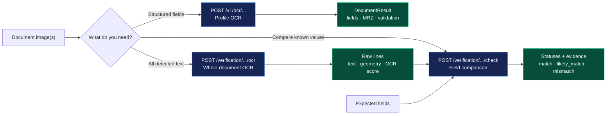
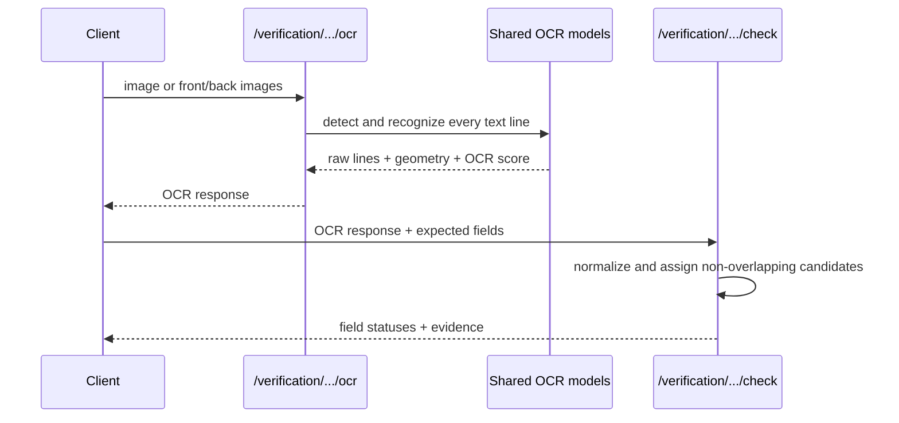

# Voight

Voight is a FastAPI service for OCR and field comparison on three supported
document types:

- the supplied Uzbekistan passport layout;
- the supplied Uzbekistan ID-card layout, submitted as `front` and `back`;
- the existing driving-licence layout.

The project is deliberately layout-specific. One supplied example exists for
the passport and ID card, so the profiles are a maintainable implementation for
those layouts—not a claim of general identity-document accuracy.

## Start here

New contributors and operators should follow
[`docs/getting-started.md`](docs/getting-started.md). It has the shortest
clone-to-running-service path for CPU Docker, local CPU development, and the
server-only GPU deployment. The CPU Docker path is the recommended first run
because it provisions the pinned models without requiring a host model cache.

## Choose the operation

There are three different operations. Pick the one that matches the data you
need:



| Operation | Routes | Result |
|---|---|---|
| Profile OCR | `/v1/ocr/...` | Structured fields, MRZ data where applicable, validation, confidence, and timings |
| Whole-document OCR | `/verification/.../ocr` | Every detected text line with OCR confidence and geometry |
| Field comparison | `/verification/.../check` | Compare expected field values with an OCR response and return evidence/statuses |

`/verification` is not another spelling of the profile OCR route. It does not
localize or rectify the document, use profile ROIs, parse visible fields, or
run specialized MRZ recognition. Its OCR response is intentionally raw; its
`/check` operation performs the comparison separately. Verification OCR reuses
the shared text detector and Latin recognizer; `/check` performs no model
inference. For passport and ID-card checks, the matcher may also interpret
valid MRZ-shaped lines already present in the submitted OCR response as
additional evidence.

## API

The complete route inventory is:

| Method | Route | Purpose |
|---|---|---|
| `GET` | `/v1/health/live` | Liveness |
| `GET` | `/v1/health/ready` | Configuration and model readiness |
| `POST` | `/v1/ocr/passport` | Profile passport OCR |
| `POST` | `/v1/ocr/passport/batch` | Profile passport batch OCR |
| `POST` | `/v1/ocr/id-card` | Profile ID-card OCR |
| `POST` | `/v1/ocr/id-card/batch` | Profile ID-card batch OCR |
| `POST` | `/v1/ocr/driving-license` | Profile driving-licence OCR |
| `POST` | `/v1/ocr/driving-license/batch` | Profile driving-licence batch OCR |
| `POST` | `/verification/passport/ocr` | Whole-document passport OCR |
| `POST` | `/verification/passport/ocr/batch` | Whole-document passport batch OCR |
| `POST` | `/verification/id-card/ocr` | Whole-document ID-card OCR |
| `POST` | `/verification/id-card/ocr/batch` | Whole-document ID-card batch OCR |
| `POST` | `/verification/driving-licence/ocr` | Whole-document driving-licence OCR |
| `POST` | `/verification/driving-licence/ocr/batch` | Whole-document driving-licence batch OCR |
| `POST` | `/verification/passport/check` | Compare passport fields |
| `POST` | `/verification/id-card/check` | Compare ID-card fields |
| `POST` | `/verification/driving-licence/check` | Compare driving-licence fields |

### Profile OCR: `/v1`

Single-document requests return `{"result": ...}`:

```bash
# Passport
curl --fail -F image=@passport.jpg \
  http://127.0.0.1:8000/v1/ocr/passport

# ID card: both images are one logical document
curl --fail -F front=@front.jpg -F back=@back.jpg \
  http://127.0.0.1:8000/v1/ocr/id-card

# Driving licence
curl --fail -F image=@driving-license.jpg \
  http://127.0.0.1:8000/v1/ocr/driving-license
```

The structured result contains `document_type`, `layout`, `fields`, optional
`mrz`, `validations`, `warnings`, document/field confidence, and timings.
Confidence includes its source and is not a calibrated probability.

Batch routes preserve input order. Passport and driving-licence batches accept
repeated `images` fields, a ZIP `archive`, or both:

```bash
curl --fail -F images=@passport-1.jpg -F images=@passport-2.jpg \
  http://127.0.0.1:8000/v1/ocr/passport/batch

curl --fail -F archive=@driving-licences.zip \
  http://127.0.0.1:8000/v1/ocr/driving-license/batch
```

ID-card batches use one ZIP with one directory per card:

```text
id-cards.zip
├── card-001/front.jpg
├── card-001/back.jpg
├── card-002/front.png
└── card-002/back.png
```

```bash
curl --fail -F archive=@id-cards.zip \
  http://127.0.0.1:8000/v1/ocr/id-card/batch
```

Each batch item has exactly one result or error. ZIP paths are validated;
traversal/absolute paths, encrypted entries, oversized entries, and incomplete
ID-card pairs are rejected. See the complete request and response contract in
[`docs/api.md`](docs/api.md).

### Whole-document OCR and comparison: `/verification`

The OCR call scans the submitted image instead of a configured document region:



| Method | Route | Input |
|---|---|---|
| `POST` | `/verification/passport/ocr` | multipart `image` |
| `POST` | `/verification/id-card/ocr` | multipart `front` and `back` |
| `POST` | `/verification/driving-licence/ocr` | multipart `image` |
| `POST` | `/verification/passport/ocr/batch` | repeated `images`, `archive`, or both |
| `POST` | `/verification/id-card/ocr/batch` | paired ZIP archive |
| `POST` | `/verification/driving-licence/ocr/batch` | repeated `images`, `archive`, or both |
| `POST` | `/verification/passport/check` | JSON OCR response plus `fields` |
| `POST` | `/verification/id-card/check` | JSON ID-card OCR response plus `fields` |
| `POST` | `/verification/driving-licence/check` | JSON OCR response plus `fields` |

```bash
curl --fail -F image=@passport.jpg \
  http://127.0.0.1:8000/verification/passport/ocr
```

It returns lines such as:

```json
{
  "lines": [
    {
      "line_id": "0",
      "text": "ABDULLAYEV",
      "confidence": 0.98,
      "confidence_source": "ocr_token",
      "bbox": [12, 40, 280, 76],
      "reading_order": 0,
      "side": "image"
    }
  ]
}
```

Send that OCR response, plus the expected fields, to the matching `/check`
route:

```bash
curl --fail http://127.0.0.1:8000/verification/passport/check \
  -H 'content-type: application/json' \
  -d '{"ocr":{"lines":[{"line_id":"0","text":"ABDULLAYEV","confidence":0.98,"confidence_source":"ocr_token","side":"image"}]},"fields":{"surname":"ABDULLAYEV"}}'
```

Comparison is global and one-to-one: an OCR line or text span cannot satisfy
two expected fields. Bounded adjacent lines may form one candidate. Results
use these statuses:

- `match`: normalized exact match;
- `likely_match`: fuzzy evidence for names and ordinary text;
- `mismatch`: a usable competing OCR value was found;
- `not_found`: no usable candidate was found.

Dates and identifiers are strict: a close fuzzy value is not a successful
comparison. Every field result carries the comparison score source and the
OCR evidence used, including the side for ID-card evidence. The comparison is
not an identity decision or a calibrated probability.

Verification also has passport, ID-card, and driving-licence batch OCR routes.
Passport and driving-licence use repeated `images` or an `archive`; ID cards
use paired ZIP directories. The v1 driving route is spelled
`driving-license`; the verification route is spelled `driving-licence`.

The live OpenAPI schema and interactive request forms are available at
[`/docs`](http://127.0.0.1:8000/docs); the schema is at
[`/openapi.json`](http://127.0.0.1:8000/openapi.json). Full examples and
artifact behavior are in [`docs/api.md`](docs/api.md).

## How profile OCR works

Profile OCR follows this path:

```text
upload → validate/decode → localize and rectify → crop profile regions
→ detect text → keep field-region text → recognize lines
→ parse fields and MRZ → validate/reconcile → structured response
```

Passport localization is anchored by the detected MRZ. ID-card front and back
are localized as separate regions of one logical document. Driving-licence
extraction preserves the recognized text and current field mapping.

Compatible work inside a logical request is batched at model stages and output
order is restored. Separate HTTP requests are not merged into a model batch.
Actual configured and submitted tensor batch sizes are available in diagnostics.

## Run on Linux

### Supported runtime matrix

| Target | Host requirement | Setup | Verification status |
|---|---|---|---|
| Local CPU | Linux x86_64, Python 3.12, `uv` | `make install`, `make run` | Validated |
| CPU Docker | Linux x86_64, Docker Engine, Compose v2 | `make docker-cpu-build`, `make docker-cpu-up-d` | Image build and readiness validated |
| GPU Docker | Linux x86_64, NVIDIA Container Toolkit, designated Tesla V100 | `./setup.sh gpu` | Server-only; runtime not yet validated |

The GPU target is not a generic GPU claim. Use it only on the designated
Linux NVIDIA server described in [`benchmarks/gpu/server-checklist.md`](benchmarks/gpu/server-checklist.md).
Other GPU models, drivers, CUDA installations, or CPU architectures require
separate validation.

### CPU Docker

Requirements: Docker with Compose v2 and internet access for the first build.

```bash
git clone <repository-url> voight
cd voight
./setup.sh
```

`setup.sh` creates `.env`, builds and tests the CPU image, starts the service,
and waits for `/v1/health/ready`. The image contains the pinned CPU runtime and
prepared model assets; it does not use a host model directory. Stop it with:

```bash
make docker-cpu-down
```

Use [`docs/deployment.md`](docs/deployment.md) for Compose environment files,
artifact storage, offline startup behavior, and the GPU server procedure.

On the designated V100 server, run `./setup.sh gpu`. This is the only supported
GPU setup path; it checks `nvidia-smi`, switches `.env` to `RUNTIME_TARGET=gpu`,
builds/tests the GPU image, starts it, and waits for readiness. Amazon Nova or
Bedrock is not part of this repository's runtime; the implementation uses the
V100-oriented Paddle/ONNX GPU image.

## Develop locally

Local development and tests are CPU-only. Python 3.12 and `uv` are required.

```bash
make install
make run
```

`make run` serves the local CPU API on port `8888` by default. The optional
`make run-dev` target adds auto-reload. Docker serves on host port `8000` by
default. Run `make help` for dataset, model, validation, Docker, and benchmark
commands.

## Usage and validation record

```text
Usage:

  # CPU
  make install
  make run

  On the GPU server only:

  ./setup.sh gpu
```

Validation:

- `make check` passed.
- Full CPU suite: run `make test` for the current result; real-model checks skip
  unless an explicit local model cache is available.
- Dependency separation test passed.
- No GPU packages were installed, imported, built, or executed.

Known limitation: `uv pip check` still reports that `capybara-docsaid`
declares `onnxruntime-gpu` on Linux. That is the intentional trade-off of this
workaround.

## Important limits

- Only the three supplied layouts are supported. The ID-card input is always a
  front/back pair.
- The profiles are based on one passport example and one ID-card pair. Do not
  infer general accuracy or train a detector from this data.
- Local execution is CPU-only. The GPU image and benchmark executor are for the
  deployment server with the specified Tesla V100; GPU behavior has not yet
  been validated there.
- Model confidence is reported with its source. OCR confidence is not a
  probability without calibration data.
- `LOGGING=true` writes uploaded images and intermediate artifacts under
  `LOG_DIR`; use `LOGGING=false` when those artifacts should not be saved.
- Use only document data that you are authorized to process. New local data
  belongs in the ignored `dataset/` directory.

## Documentation

- [`docs/getting-started.md`](docs/getting-started.md) — first-time setup for CPU Docker, local CPU, and GPU server
- [`docs/api.md`](docs/api.md) — route contracts and examples
- [`docs/architecture.md`](docs/architecture.md) — processing paths and model roles
- [`docs/configuration.md`](docs/configuration.md) — environment settings
- [`docs/models.md`](docs/models.md) — model defaults and provisioning
- [`docs/deployment.md`](docs/deployment.md) — CPU/GPU deployment
- [`docs/development.md`](docs/development.md) — local development and extension points
- [`docs/dataset.md`](docs/dataset.md) — authorized fixtures and profile geometry
- [`scripts/dataset/README.md`](scripts/dataset/README.md) — local ground-truth annotation
- [`docs/benchmarking.md`](docs/benchmarking.md) — CPU and GPU benchmark workflows
- [`benchmarks/gpu/README.md`](benchmarks/gpu/README.md) — server-only GPU benchmark suite
- [`benchmarks/gpu/server-checklist.md`](benchmarks/gpu/server-checklist.md) — V100 preflight and execution checklist
- [`docs/migration.md`](docs/migration.md) — removed legacy routes and replacements
- [`docs/reorganization-2026-08.md`](docs/reorganization-2026-08.md) — historical repository layout record
