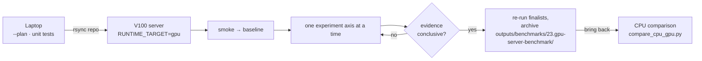

# Voight GPU benchmark suite

This reusable, staged harness is for the V100 server. Planning, statistics,
digest, parser, and comparison code are CPU-safe and do not import Paddle,
ONNX Runtime, CUDA, or Docker. Real execution is refused unless all server
guards pass. Use the [server checklist](server-checklist.md) for host
preflight and the exact execution commands.



## Laptop workflow

```bash
uv run --no-sync python benchmarks/gpu/gpu_benchmark.py --plan --experiment recognition-batch
uv run --no-sync python benchmarks/gpu/gpu_benchmark.py --plan --experiment detector-resolution --values 100,80,60
uv run --no-sync python -m unittest discover -s benchmarks/gpu/tests -v
uv run --no-sync python -m compileall -q benchmarks/gpu
uv run --no-sync python benchmarks/gpu/compare_cpu_gpu.py <gpu-output> <cpu-output>
```

Do not use `--execute` on the laptop. No GPU package is needed for planning or
tests, and importing the package never starts a container.

## V100 workflow

1. Transfer the repository and benchmark dataset/artifacts to the server.
2. Set `RUNTIME_TARGET=gpu`, `GPU_ID=0`, and `VOIGHT_GPU_BENCHMARK_HOST=1`; keep `TEXT_RECOGNITION_PROCESSES=1`.
3. Build/prepare `voight:gpu` using the pinned GPU target.
4. Run smoke, then baseline.
5. Run one experiment axis at a time and inspect the saved output.
6. Re-run finalists with the same fresh-runtime/repeat settings.
7. Archive the result directory and bring it back for CPU comparison.

Example transfer from the repository parent:

```bash
rsync -az --exclude .venv --exclude outputs/benchmarks/23.gpu-server-benchmark/ voight/ v100:/srv/voight/
```

```bash
export RUNTIME_TARGET=gpu GPU_ID=0 VOIGHT_GPU_BENCHMARK_HOST=1
docker build --target gpu -t voight:gpu .
uv run --no-sync python benchmarks/gpu/gpu_benchmark.py --execute --mode smoke
uv run --no-sync python benchmarks/gpu/gpu_benchmark.py --execute --mode baseline
uv run --no-sync python benchmarks/gpu/gpu_benchmark.py --execute --experiment recognition-batch --values 2,4,8,16,32,64
uv run --no-sync python benchmarks/gpu/gpu_benchmark.py --execute --experiment detector-resolution --values 100,80,60
uv run --no-sync python benchmarks/gpu/gpu_benchmark.py --execute --experiment precision --values fp32,fp16
uv run --no-sync python benchmarks/gpu/gpu_benchmark.py --execute --experiment backend --values normal,hpi,tensorrt
uv run --no-sync python benchmarks/gpu/gpu_benchmark.py --execute --experiment concurrency --values 1,2,4,8
```

Custom JSON is an object or list of objects, for example:

```json
[{"id":"candidate-a","env":{"TEXT_RECOGNITION_BATCH_SIZE":16,"TEXT_RECOGNITION_PACKING":"aspect-ratio"}}]
```

Run it with `--execute --mode custom --config candidate.json`; use `--plan`
first. The default is one axis at a time. Full Cartesian expansion is an
explicit custom-matrix option, not the default.

For an explicit Cartesian matrix, use `--full-cartesian`:

```json
{"matrix":{"TEXT_RECOGNITION_BATCH_SIZE":[2,4],"TEXT_RECOGNITION_PACKING":["fixed-width","aspect-ratio"]}}
```

```bash
uv run --no-sync python benchmarks/gpu/gpu_benchmark.py --plan --mode custom --config matrix.json --full-cartesian
uv run --no-sync python benchmarks/gpu/gpu_benchmark.py --execute --mode custom --config matrix.json --full-cartesian
```

## Recommended staged workflow

Run 0 smoke; Run 1 GPU baseline; Run 2 localization/detection/recognition/MRZ
batch sweeps; Run 3 combined batch finalists; Run 4 FP32/FP16; Run 5
HPI/TensorRT; Run 6 packing; Run 7 detector resolution; Run 8 visible/MRZ
preprocessing; Run 9 request concurrency; Run 10 final combined candidates;
Run 11 a longer stability/final validation run. Stop after any run and choose
the next axis from measured evidence.

| Run | Axis | Values used last |
|---:|---|---|
| 0 | smoke | — |
| 1 | GPU baseline | — |
| 2 | localization/detection/recognition/MRZ batch sweeps | e.g. recognition 2,4,8,16,32,64 |
| 3 | combined batch finalists | from run 2 evidence |
| 4 | precision | fp32, fp16 |
| 5 | backend | normal, hpi, tensorrt |
| 6 | packing | fixed-width, aspect-ratio |
| 7 | detector resolution | 100, 80, 60 |
| 8 | visible/MRZ preprocessing | candidate set from CPU experiments |
| 9 | request concurrency | 1, 2, 4, 8 |
| 10 | final combined candidates | from runs 2–9 evidence |
| 11 | stability / final validation | long run |

Each configuration gets a fresh container, readiness verification, one warm-up,
three or more measured repeats, medians/IQR/min/max, background `nvidia-smi`
sampling, semantic digests, and cleanup verification. Raw diagnostics retain
configured and actual tensor batches, detector shapes, crop/padding data where
the server exposes it, and correctness fields from the API.

**[PLANNED]** Outputs are under
`outputs/benchmarks/23.gpu-server-benchmark/<UTC timestamp>/`. No GPU result
is claimed until the server run is actually performed.
