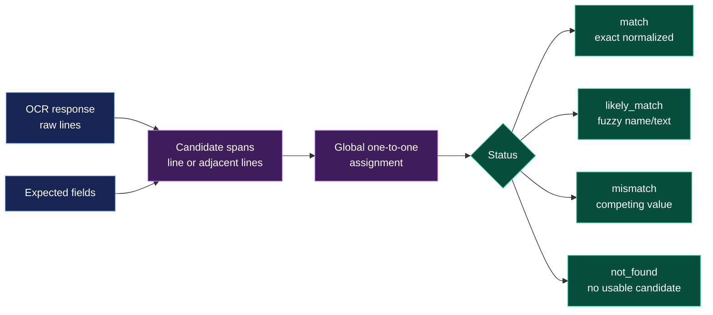

# API

The service exposes profile OCR under `/v1` and whole-document OCR/comparison
under `/verification`. The maintained profile API is versioned under `/v1`.
Successful single `/v1` requests return `{"result": ...}`; batch requests
preserve input order and give every item exactly one result or error.
Swagger groups operations into `Health`, `v1 OCR`, `Verification OCR`, and
`Verification checks` sections.

## Health

```bash
curl --fail http://127.0.0.1:8000/v1/health/live
curl --fail http://127.0.0.1:8000/v1/health/ready
```

Readiness initializes and validates configured models. With `PRELOAD=false`,
the first readiness call can take longer than later calls.

## Single documents

```bash
# Passport
curl --fail -F image=@passport.jpg \
  http://127.0.0.1:8000/v1/ocr/passport

# One logical ID card: both sides are required
curl --fail -F front=@front.jpg -F back=@back.jpg \
  http://127.0.0.1:8000/v1/ocr/id-card

# Driving licence
curl --fail -F image=@driving-license.jpg \
  http://127.0.0.1:8000/v1/ocr/driving-license
```

## Batches

Passport and driving-licence batches accept repeated `images` fields, one ZIP
`archive`, or both:

```bash
curl --fail -F images=@passport-1.jpg -F images=@passport-2.jpg \
  http://127.0.0.1:8000/v1/ocr/passport/batch

curl --fail -F archive=@driving-licences.zip \
  http://127.0.0.1:8000/v1/ocr/driving-license/batch
```

An ID-card batch is one ZIP with one directory per logical card:

```text
id-cards.zip
├── card-001/front.jpg
├── card-001/back.jpg
├── card-002/front.png
└── card-002/back.png
```

```bash
curl --fail -F archive=@id-cards.zip \
  http://127.0.0.1:8000/v1/ocr/id-card/batch
```

ZIP entries are read in memory. Absolute/traversal paths, encrypted entries,
oversized entries, and malformed side pairs are rejected. Upload limits are
documented in [configuration.md](configuration.md). The live OpenAPI schema and
interactive examples are served at `/openapi.json` and `/docs`.

## Document verification

Verification is a new additive, unversioned namespace, not a legacy route. Its
OCR routes scan the whole submitted image with the shared Paddle detector and
Latin recognizer; they do not use document profiles, profile ROIs, specialized
MRZ recognition, or field parsers:

| Method | Route | Input |
|---|---|---|
| `POST` | `/verification/passport/ocr` | multipart `image` |
| `POST` | `/verification/id-card/ocr` | multipart `front`, `back` |
| `POST` | `/verification/driving-licence/ocr` | multipart `image` |
| `POST` | `/verification/passport/ocr/batch` | repeated `images`, `archive`, or both |
| `POST` | `/verification/id-card/ocr/batch` | one paired `archive` |
| `POST` | `/verification/driving-licence/ocr/batch` | repeated `images`, `archive`, or both |
| `POST` | `/verification/passport/check` | JSON OCR response plus `fields` |
| `POST` | `/verification/id-card/check` | JSON ID-card OCR response plus `fields` |
| `POST` | `/verification/driving-licence/check` | JSON OCR response plus `fields` |

```bash
curl --fail -F image=@passport.jpg http://127.0.0.1:8000/verification/passport/ocr
curl --fail -F front=@front.jpg -F back=@back.jpg \
  http://127.0.0.1:8000/verification/id-card/ocr
curl --fail -F image=@driving-license.jpg \
  http://127.0.0.1:8000/verification/driving-licence/ocr
```

OCR responses contain raw detected lines. Confidence is the model score and is
labeled `confidence_source: "ocr_token"`; it is not a calibrated probability:

```json
{
  "lines": [
    {
      "line_id": "0",
      "text": "ABDULLAYEV",
      "confidence": 0.98,
      "confidence_source": "ocr_token",
      "bbox": [12, 40, 280, 76],
      "reading_order": 0,
      "side": "image"
    }
  ]
}
```

The corresponding `/check` routes accept the OCR response and a named
`fields` object. They perform no model inference. Matching is globally
one-to-one across OCR lines and adjacent line pairs. For passport and ID-card
requests, valid MRZ-shaped lines already present in the OCR response can also
be used as evidence; no specialized MRZ model is run. Exact normalized matches
are `match`; fuzzy name/text evidence is `likely_match`; a competing OCR value
is `mismatch`; and no usable candidate is `not_found`. Identifier and date
differences never become `likely_match`.



The route spelling is intentional: v1 uses `/driving-license`, while the
verification namespace uses `/driving-licence`.

Pass the OCR response unchanged in the check request:

```bash
curl --fail http://127.0.0.1:8000/verification/passport/check \
  -H 'content-type: application/json' \
  -d '{"ocr":{"lines":[{"line_id":"0","text":"ABDULLAYEV","confidence":0.98,"confidence_source":"ocr_token","side":"image"}]},"fields":{"surname":"ABDULLAYEV"}}'
```

The check response contains one result per expected field and a summary. Each
result includes the score source and the OCR evidence used for the assignment.
Use `/verification/id-card/check` with the ID-card OCR shape (`front` and
`back` arrays); evidence records retain the side where they were found.

For batch OCR, use one of the three explicit batch routes listed above.
Passport and driving-licence routes accept repeated `images` fields, a ZIP
`archive`, or both. The ID-card route accepts one ZIP whose entries remain
paired as `card/front.*` and `card/back.*`. Each batch item has exactly one
successful result or error and keeps its input index.

When `LOGGING=true`, OCR routes write uploaded inputs, model diagnostics,
text-detection polygons, detected line crops, preprocessed recognition inputs,
recognition results, and final response data under `LOG_DIR`. Verification OCR
uses `LOG_DIR/verification_batch/`; profile OCR uses `LOG_DIR/v1_batch/`.
Verification `/check` routes write their submitted payload, normalized OCR
lines, matcher result, and final response under `LOG_DIR/verification_check/`.
The public responses remain unchanged by artifact logging. `LOGGING=false`
performs no artifact writes.
