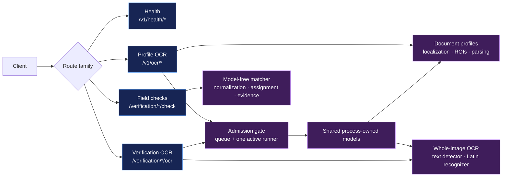
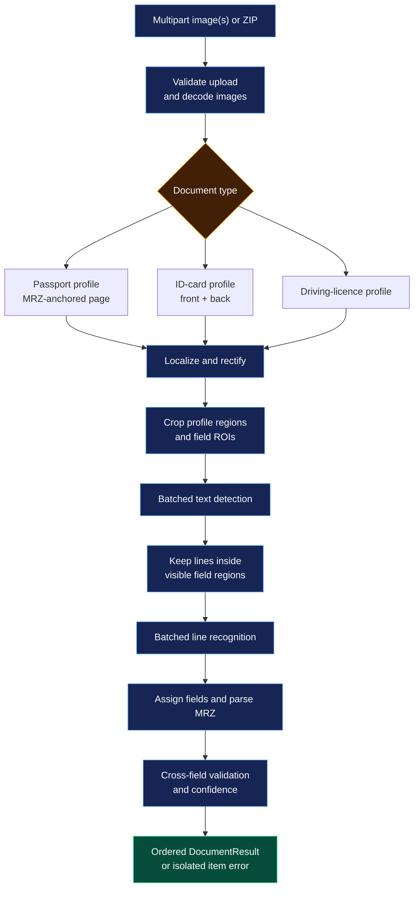
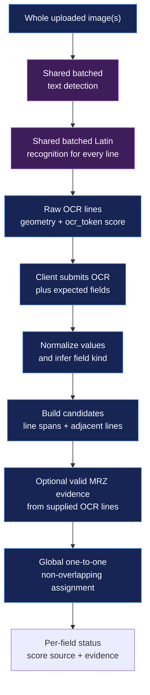

# Architecture

## System map

## Request flow

`app/main.py` is the composition root. `app/api/v1.py` owns HTTP transport,
safe in-memory ZIP expansion, asynchronous admission, and conversion to the
public schemas in `app/contracts.py` and `app/api/schemas.py`.

`app/inference/batch.py` is the shared coordinator. It groups compatible work
so DocAligner, MRZScanner, Paddle detection, and Paddle recognition receive
real tensors containing more than one sample when a request permits it. It
restores output ordering and isolates recoverable item failures. Separate HTTP
requests are admitted asynchronously but are not combined into one model call.

## Batching and failure isolation

```mermaid
flowchart LR
    request["One logical request\nwith multiple documents"] --> admit["Admission gate"]
    admit --> plan["Build stage jobs\nby compatible model + input"]
    plan --> tensor["Real tensor batch\nN > 1 when possible"]
    tensor --> run["Run shared model"]
    run --> split{"Item failed?"}
    split -->|"no"| restore["Restore original\ninput order"]
    split -->|"yes"| isolate["Record item error\nkeep siblings"]
    isolate --> restore
    restore --> response["Batch response\nresult or error per item"]

    classDef stage fill:#172554,stroke:#60a5fa,color:#fff
    classDef decision fill:#422006,stroke:#f59e0b,color:#fff
    classDef result fill:#064e3b,stroke:#34d399,color:#fff
    class request,admit,plan,tensor,run,restore stage
    class split decision
    class isolate,response result
```

## Model roles

- **DocAligner** localizes and rectifies driving licences and ID-card sides.
- **MRZScanner detection** localizes the passport data page through its MRZ and
  probes the ID-card back; the front is probed only when the back has no usable
  MRZ polygon.
- **PaddleOCR detector** finds visible and MRZ text lines after rectification.
- **PaddleOCR recognizer** is the default recognizer for visible text and MRZ.
- **MRZScanner recognition** is an optional specialized adapter. It remains
  experimental and is not the default.

`app/models.py` owns the one heavyweight instance of each selected model.
Project-owned contracts in `app/inference/contracts.py` keep document pipelines
independent of third-party result shapes. Backend and model names come from
validated environment settings, so supported models can be swapped without
changing pipeline orchestration.

The profile pipeline is the production extraction path. The verification OCR
path is intentionally narrower: it reuses only the text detector and Latin
recognizer, then returns raw lines. It does not localize documents or apply
profile geometry. The separate matcher accepts caller-supplied fields and may
derive additional MRZ evidence from valid MRZ-shaped lines already returned by
OCR; it does not run a specialized MRZ model.

## Document behavior

Production profile JSON lives in `config/documents/`. Passport and ID-card
pipelines in `app/documents/identity.py` own their regions, MRZ side/page, and
visible-to-MRZ reconciliation. Driving-licence parsing remains in
`app/documents/driving_license_fields.py`. Geometry, ROI assignment, confidence
aggregation, and artifact handling are shared.

OCR scores are returned with their source and
`calibrated_probability: false`; they are not represented as probabilities.

## Verification flow

The verification transport owns batch admission and ID-card side pairing. Its
matcher owns normalization, type-aware scoring, adjacent-line candidates, and
constrained assignment. The verification OCR coordinator shares the
process-owned text detector and recognizer with the profile pipeline. No profile
geometry or field position participates in this flow.
