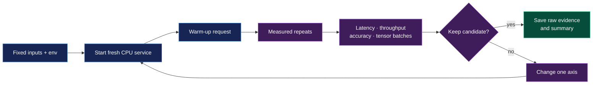

# Benchmarking

## Measurement loop



Start the CPU service, then run the maintained end-to-end benchmark:

```bash
make docker-cpu-up-d
make benchmark-cpu
```

`benchmarks/maintained/benchmark_batch_complexity.py` sends passport, paired
ID-card, and driving-licence requests at multiple sizes. It records latency,
throughput, and the diagnostics that prove model calls received tensors with
`N > 1`. Results go to ignored `benchmarks/results/`; other benchmark tools
write under `outputs/benchmarks/`.

Maintained recognition-only comparisons are under `benchmarks/maintained/`.
The supported batch benchmark requires an explicit prepared local cache:

```bash
MODEL_DIR=/path/to/models make benchmark-recognition
```

Use at least one warm-up and three measured repeats. Report medians, keep input
images and configuration constant, close unrelated CPU-heavy work, and record
CPU model/thread details. Batch size means the tensor dimension received by a
model, not the number of one-image calls made by a Python loop.

Tools whose purpose is reproducing a completed experiment live in
`benchmarks/historical/`: the older `benchmark.py`, `contrast_benchmark.py`,
and `final_benchmark.py` capture historical model/preprocessing selection
experiments, and the remaining scripts reproduce the individual CPU-selection
experiments (model matrix, batch sweep, thread sweep, detector resolution,
packing, recognizer A/B, MRZ preprocessing reconciliation) behind the locked
configuration. They are not production defaults. GPU benchmark scripts must
run only during the V100 task.

The fixed-crop preprocessing benchmark runs Phases A-D on CPU with the
measured L4-D1-R2 settings and writes raw JSONL, fixed `.npy` crops, compact
CSV tables, finalist payloads, and lifecycle evidence under
**[PLANNED]** `outputs/benchmarks/15.preprocessing-candidate-sweep/<timestamp>/`
when executed:

```bash
uv run --no-sync python benchmarks/maintained/preprocessing_benchmark.py \
  --model-dir models/benchmark --repeats 3
```

Its benchmark-only environment hooks are unset by default; the production
pipeline therefore keeps its existing preprocessing behavior.

The old acceptance-gate checklist for the CPU thread-count benchmark is no
longer a living document; the measured `CPU_THREADS=4` decision is recorded in
the project decisions. Historical benchmark drivers remain separate from the
maintained benchmark commands.

The reusable GPU suite is in [benchmarks/gpu](../benchmarks/gpu/README.md).
Use its `--plan` mode on a CPU laptop; execute mode is guarded for the V100
server and runs one fresh container per configuration.

## Whole-document verification baseline

Run the reproducible CPU benchmark with an explicit prepared model cache:

```bash
MODEL_DIR=models/benchmark make benchmark-verification
```

It discovers `dataset/` in stable passport, ID-card, licence order, runs one
warm-up and three measured fresh-server repetitions over every valid document.
Results are written to ignored
`outputs/benchmarks/16.verification-baseline/<UTC run>/`. The run records startup/model
loading separately, OCR/check client and server timings, existing OCR tensor
batch diagnostics, procfs RSS and cleanup evidence, raw responses, field
accuracy rows, and a concise summary. Use `--limit 1` for the smallest
CPU-only validation before the full corpus.

The same run is also organized for human inspection. Open `README.md` and
`analysis.md` first, then a measured document under
`01.repeat-1/batch/<number>/<type>-<id>/`. Single-image documents contain
`source.png`, `detection.png`, `recognition_contact_sheet.png`, individual
recognition crops, `ocr_summary.md`, and `fuzzy_matching.md` directly in that
folder. ID cards put those image artifacts under `front/` and `back/`; the
document-level fuzzy report covers both sides. JSON alongside each visual
artifact preserves the machine-readable evidence.

The check benchmark sends one stored field per request so the current global
assignment matcher remains a bounded measurement. Document-level correctness
is reconstructed from the per-field decisions; the exact configuration is
recorded in `environment.json`, while each fresh process keeps its effective
readiness payload and lifecycle evidence under `NN.repeat-*`.

The internal verification batch-size experiment is separate from HTTP batch
size. Run it with a prepared CPU model cache:

```bash
MODEL_DIR=models/benchmark make benchmark-verification-batch-sizes
```

It writes the workload audit, rotated one-axis/final configuration results,
raw OCR differences, tensor batch details, memory measurements, and report under
`outputs/benchmarks/19.verification-batch-size-sweep/<UTC run>/`. The current
whole-image verification route does not invoke document localization or
specialized MRZ recognition; only verification text detection and recognition
overrides are benchmarked.
