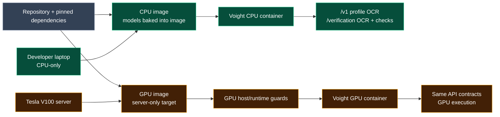

# Deployment

## Runtime topology



## Support matrix

The supported deployment target is Linux x86_64:

| Target | Host prerequisites | Status |
|---|---|---|
| CPU process | Python 3.12 and `uv` | Supported and CPU-tested |
| CPU container | Docker Engine and Compose v2 | Image build and readiness tested |
| GPU container | NVIDIA Container Toolkit and the designated Tesla V100 server | Configuration prepared; runtime validation pending |

The GPU image is not currently a claim of support for arbitrary NVIDIA
hardware. Other GPU models, drivers, CUDA installations, or CPU architectures
must be validated separately. Local development and all local tests remain
CPU-only.

## CPU

For local CPU development:

```bash
make install
make run
```

For the reproducible CPU container:

```bash
cp .env.example .env
make docker-cpu-build
make docker-cpu-up-d
curl --fail http://127.0.0.1:8000/v1/health/ready
make docker-cpu-logs
make docker-cpu-down
```

The image uses pinned CPU Paddle and ONNX Runtime packages, runs one Uvicorn
worker as the unprivileged `voight` user, exposes container port 8000, and has a
readiness health check. `VOIGHT_PORT` controls the host port. The
`voight-artifacts` named volume persists `/app/logs` across container recreation.
Use `make docker-cpu-artifacts-copy` before
`make docker-cpu-artifacts-clean` when saved debugging output is needed.

```bash
docker volume ls
docker volume rm voight_voight-artifacts  # destructive: removes saved artifacts
```

The exact Compose-prefixed volume name can vary with the project directory; use
`docker volume ls` before removal. Models are stored in the image, not this
volume.

Both `/v1` profile extraction and `/verification` whole-document verification
are served by the same CPU image. Verification does not require an additional
model cache.

Make passes `ENV_FILE` to both Compose interpolation and the container's
environment file. To use another file, run for example
`make ENV_FILE=.env.staging docker-cpu-up-d`. Direct `docker compose` commands
default to `.env.example`; set `VOIGHT_ENV_FILE` when using a different file.

## GPU

GPU commands are server-only. From the repository root, create `.env`, then
set `RUNTIME_TARGET=gpu` and `GPU_ID` there:

```bash
cp .env.example .env
make docker-gpu-build
make docker-gpu-test
make docker-gpu-up-d
```

The GPU target pins Paddle GPU for CUDA 11.8 and ONNX Runtime GPU, requests one
NVIDIA GPU, keeps one application worker, and shares the production pipeline.
HPI, TensorRT, and FP16 remain disabled unless explicitly configured. GPU
inference has not yet been verified on the target V100; see the limitation in
the [root README](../README.md) and the [GPU benchmark checklist](../benchmarks/gpu/server-checklist.md).

No GPU packages are installed, imported, built, or executed during local
development or testing. The Linux `uv pip check` warning that
`capybara-docsaid` declares `onnxruntime-gpu` is the intentional dependency
separation workaround; it does not change the CPU runtime selection.

Rollback is `make docker-gpu-down`, set `RUNTIME_TARGET=cpu`, then run the CPU
commands above. Never build, import-test, or run the GPU target on a CPU laptop.

## Offline behavior

The first image build needs internet access for Python packages and Paddle
weights. Docker can rebuild from local layer cache when all required layers are
present. A built image can start and serve offline because runtime source checks
are disabled and readiness verifies the baked assets.
