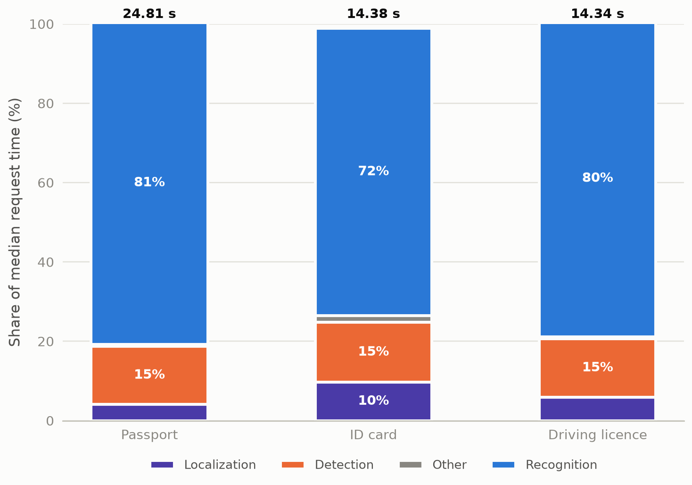

# Experiment 01 — Old full-pipeline baseline

The old production pipeline (PP-OCRv6 medium recognizer) spent 72–81% of
request time inside text recognition, so the recognizer — not detection,
localization, or parsing — was the correct optimization target. This report
records only that baseline; it does not assume a result from another run.

## Metadata

| Field | Value |
|---|---|
| Run date | 2026-08-14 (passport 06:53, ID card 07:14, driving licence 07:36 UTC) |
| Status | historical — baseline context; no surviving default |
| Decisions touched | none directly; motivated the work behind D-018/D-021 |
| Corpus | 9 passports, 4 logical ID cards, 7 driving licences |
| Runtime | CPU, 4 threads, Paddle 3.2.2 / PaddleOCR 3.7.0 |
| Configuration | `PP-OCRv6_medium_det` + `PP-OCRv6_medium_rec`, `fastvit_sa24`, generic-Paddle MRZ `20250221`; batches L16/D16/R32/M16 |
| Driver | `benchmarks/maintained/pipeline_breakdown.py` |
| Raw evidence | `outputs/benchmarks/03.pipeline-stage-breakdown/{01.passport,02.id-card,03.driving-license}/01.full-production` |

## 1. Question and why it mattered

Where does end-to-end request time actually go in the old pipeline? The answer
decided which component the recognizer-switch and batching work should target
first. Had recognition been a minor share, the model-matrix experiment would
have been the wrong investment.

## 2. Method

Three measured repeats of the full production pipeline per document type over
the whole corpus, plus throughput-scaling runs from 1 to 16 logical documents.
Stage medians below are from the full-corpus repeats. The old harness measured
some stages independently of the wall-clock total, so stage sums do not exactly
equal the totals.

## 3. Results


*Recognition dominates every route — 81/72/80% of median request time. Median
of 3 full-corpus repeats; stages under 1% (canonicalization, ROI cropping, MRZ
work) folded into Other; parsing/validation was not isolated by the historical
harness. Totals above the bars are median wall-clock.*

Median stage seconds per document type (full-corpus repeats):

| Document type | Localization | Canonicalization | Detection | ROI crop | Recognition | MRZ work | Total (wall) |
|---|---:|---:|---:|---:|---:|---:|---:|
| Passport (9) | 1.0117 | 0.0034 | 3.6457 | 0.0550 | 20.1843 | 0.0024 | 24.8137 |
| ID card (4) | 1.3956 | 0.0047 | 2.1642 | 0.0217 | 10.4208 | 0.0055 | 14.3790 |
| Driving licence (7) | 0.8454 | 0.0047 | 2.1152 | 0.0206 | 11.4605 | 0.0000 | 14.3412 |

Recognition is 81% / 72% / 80% of median request time (share of wall clock).
Bucket mapping: old `data_crop + line_crop` → ROI crop; old
`mrz_crop_preprocess + mrz_recognition` → MRZ work.

Correctness of the same runs:

| Document type | Visible fields exact | Correct characters | MRZ full exact |
|---|---:|---:|---:|
| Passport | 77/117 | 416/932 | 6/9 |
| ID card | 45/48 | 472/475 | 4/4 |
| Driving licence | 56/91 | 1383/1433 | Not applicable |
| **Corpus total** | **178/256** | **2271/2840** | **10/13** |

## 4. Interpretation

Recognition dominated every route under the old configuration, so recognizer
cost was the highest-leverage target; detection was second at 15% and
localization material only for ID cards. This report does not estimate the
effect of changing any component; that requires a separately controlled
comparison.

## 5. Decision and consequence

No default survives from this experiment. Its consequence is directional: the
largest measured opportunity was recognizer cost, while localization and
parsing were not the first targets on this corpus.

## 6. Negative results and dead ends

- The old harness did not isolate parsing/validation, did not record process
  peak RSS, and did not expose actual crop dimensions, real tensor batch sizes,
  or detector tensor H/W. Those gaps are why this run is context, not
  decision-grade evidence: the reported batch settings cannot be verified as
  real multi-sample tensor calls.

## 7. Limits

This predates shape-invariant batching and its instrumentation; the reported
batches (16/16/32) cannot be verified as real multi-sample tensor calls. It is
an uncontrolled profile and should not be used to estimate another
configuration.

## 8. Raw data disposition

| Path | Size | Status | Safe to delete after this report |
|---|---:|---|---|
| `outputs/benchmarks/03.pipeline-stage-breakdown/{01.passport,02.id-card,03.driving-license}/01.full-production` | ~2 MB | primary evidence | yes — stage, correctness, and total tables are embedded above |
| `outputs/benchmarks/03.pipeline-stage-breakdown/*/` other variants (`localization_preparation*`, `mrz_only*`, `sensitivity*`) | ~2.7 MB | supporting runs from the same harness, not cited by any decision | yes |

Per-request detail is regenerable via the maintained driver and the local
corpus.

## 9. Reproduction

```bash
make validate   # writes the CPU extraction and true-batch baseline
# stage breakdown per document type:
.venv/bin/python benchmarks/maintained/pipeline_breakdown.py --help
```

## Changelog

- 2026-08-26 (2nd): figure text moved out of the image per the updated [00](00.TEMPLATE.md)
  figure law — the PNG now carries marks, legend, axis names, and value labels
  only; the description became the caption above. No content changes.
- 2026-08-26: rewritten to the [00](00.TEMPLATE.md) standard. Removed the
  stage-share figure's duplicate framing (kept one figure; the table carries
  exact values). Shares restated on the wall-clock basis the figure uses.
  Added raw-data disposition and this changelog; no measurements changed.
- 2026-08-26: removed cross-report conclusions so this baseline can be read and
  reproduced independently.
