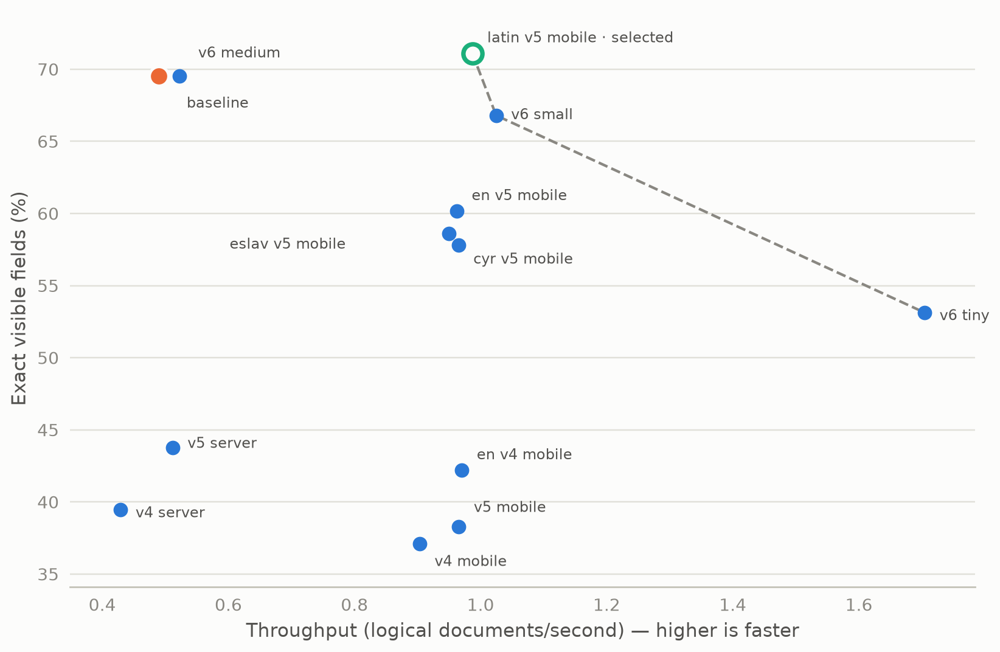
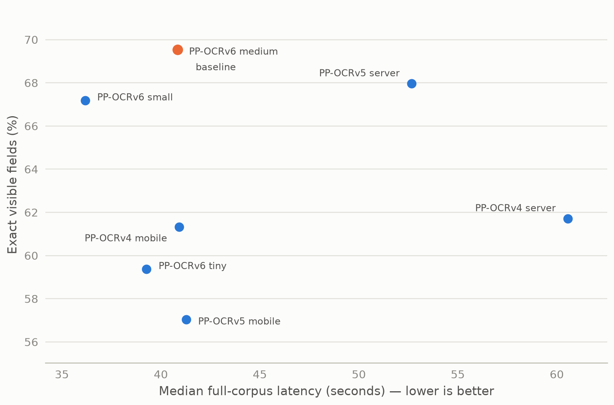

# Experiment 02 — CPU model matrix

Across 27 measured candidates, `latin_PP-OCRv5_mobile_rec` was the only fast
recognizer that did not lose visible-field exactness (182/256, best of all
candidates) while nearly doubling throughput over the medium baseline
(0.987 vs 0.523 docs/s, −474 MB RSS). It was selected; every other axis
(detector, aligner, MRZ route) kept its incumbent because no alternative
improved accuracy without unacceptable loss.

## Metadata

| Field | Value |
|---|---|
| Run date | 2026-08-19 18:31 |
| Status | current evidence for model selection on this corpus |
| Decisions touched | D-018, D-021 |
| Corpus | 20 logical documents — 9 passports, 4 ID cards, 7 driving licences; 256 visible fields, 2,840 visible characters, 13 MRZ documents |
| Runtime | CPU, 4 threads; fresh server per candidate; 1 warm-up + 3 measured repeats |
| Fixed components | `PP-OCRv6_medium_det`, `fastvit_sa24`, MRZ detection `20250222`, generic-Paddle MRZ recognition; batches L16/D16/R32/M16 |
| Driver | `benchmarks/historical/model_matrix_benchmark.py` |
| Raw evidence | `outputs/benchmarks/06.model-matrix-comparison/20260819T183142Z` |

## 1. Question and why it mattered

Which detector, recognizer, document aligner, and MRZ route should production
use, given measured CPU speed and accuracy on the supplied corpus — instead of
vendor marketing or model-card claims? The answer locked the model set the
service still ships.

## 2. Method

One variable changed per candidate from the baseline configuration; each
candidate ran in a fresh server with loaded-model verification and lifecycle
checks. Accuracy is exact visible fields against the annotation ground truth;
latency is the median full-corpus response; 27 candidates completed, 2 were
blocked by unavailable pinned model assets.

## 3. Results


*Recognizer candidates: throughput vs exact visible fields. The non-dominated
frontier (dashed) runs latin v5 mobile → v6 small → v6 tiny; the baseline
point is dominated — slower and no more accurate than latin v5 mobile.*


*Detector candidates: no alternative reaches the incumbent's 178/256 fields —
every faster or bigger detector loses 4–36 fields. This is the visual case for
keeping `PP-OCRv6_medium_det`.*

Full candidate table (all completions; baseline repeated per category for
reference). CER = visible-character error rate.

| Category | Candidate | Exact fields | CER | Median s | docs/s | RSS MB |
|---|---|---:|---:|---:|---:|---:|
| baseline | medium_det + medium_rec | 178/256 | 20.04% | 40.85 | 0.490 | 3,654 |
| detector | `PP-OCRv6_medium_det` (incumbent) | 178/256 | 20.04% | 40.81 | 0.490 | 3,518 |
| detector | `PP-OCRv6_small_det` | 172/256 | 23.24% | 36.18 | 0.553 | 2,994 |
| detector | `PP-OCRv6_tiny_det` | 152/256 | 30.74% | 39.28 | 0.509 | 3,201 |
| detector | `PP-OCRv5_server_det` | 174/256 | 21.41% | 52.67 | 0.380 | 3,518 |
| detector | `PP-OCRv5_mobile_det` | 146/256 | 30.56% | 41.27 | 0.485 | 3,101 |
| detector | `PP-OCRv4_server_det` | 158/256 | 25.81% | 60.56 | 0.330 | 3,671 |
| detector | `PP-OCRv4_mobile_det` | 157/256 | 23.91% | 40.93 | 0.489 | 3,055 |
| recognizer | `PP-OCRv6_medium_rec` (incumbent) | 178/256 | 20.04% | 38.27 | 0.523 | 3,648 |
| recognizer | `PP-OCRv6_small_rec` | 171/256 | 21.13% | 19.52 | 1.025 | 3,943 |
| recognizer | `PP-OCRv6_tiny_rec` | 136/256 | 24.08% | 11.73 | 1.704 | 3,422 |
| recognizer | `PP-OCRv5_server_rec` | 112/256 | 25.14% | 39.10 | 0.512 | 5,102 |
| recognizer | `PP-OCRv5_mobile_rec` | 98/256 | 26.73% | 20.71 | 0.966 | 3,481 |
| recognizer | **`latin_PP-OCRv5_mobile_rec`** | **182/256** | 21.34% | 20.26 | 0.987 | 3,174 |
| recognizer | `en_PP-OCRv5_mobile_rec` | 154/256 | 24.86% | 20.78 | 0.962 | 3,278 |
| recognizer | `cyrillic_PP-OCRv5_mobile_rec` | 148/256 | 22.36% | 20.73 | 0.965 | 3,133 |
| recognizer | `eslav_PP-OCRv5_mobile_rec` | 150/256 | 21.37% | 21.06 | 0.950 | 3,351 |
| recognizer | `PP-OCRv4_server_rec` | 101/256 | 25.81% | 46.60 | 0.429 | 3,861 |
| recognizer | `PP-OCRv4_mobile_rec` | 95/256 | 27.39% | 22.14 | 0.903 | 3,187 |
| recognizer | `en_PP-OCRv4_mobile_rec` | 108/256 | 25.56% | 20.61 | 0.970 | 3,390 |
| aligner (heatmap) | `fastvit_sa24` (incumbent) | 178/256 | 20.04% | 40.51 | 0.494 | 3,613 |
| aligner (heatmap) | `fastvit_t8` | 142/256 | 34.15% | 38.24 | 0.523 | 3,539 |
| aligner (heatmap) | `lcnet100` | 78/256 | 85.28% | 17.97 | 1.113 | 2,639 |
| aligner (point) | `lcnet050` | 141/256 | 46.41% | 38.27 | 0.523 | 3,170 |
| MRZ | detection `20250222` + generic-paddle (incumbent) | 178/256 | 20.04% | 44.09 | 0.454 | 3,821 |
| MRZ | detection `20250222` + recognition `20250221` | 180/256 | 19.44% | 48.09 | 0.416 | 3,782 |
| MRZ | detection `20250222` + spotting `20240919` | 180/256 | 19.44% | 42.15 | 0.475 | 3,623 |
| — | `mobilenetv2_140`, `lcnet050` (heatmap) | blocked | — | — | — | — |

Blocked candidates: pinned DocAligner heatmap assets were unavailable. The two
baseline rows for the same configuration (40.85 s vs the recognizer row's
38.27 s) bound run-to-run variance at roughly 6%.

The selected combination was measured end-to-end, not inferred by adding
single-variable deltas:

| Metric | Incumbent | Selected (`latin_PP-OCRv5_mobile_rec`) | Δ |
|---|---:|---:|---|
| Exact visible fields | 178/256 | 182/256 | +4 |
| Visible CER | 20.04% | 21.34% | +1.30 pp |
| Whole documents exact | 1/20 | 0/20 | −1 |
| Median latency | 38.270 s | 20.264 s | 1.89× faster |
| Throughput | 0.523 docs/s | 0.987 docs/s | +88.9% |
| Peak server RSS | 3,648 MB | 3,174 MB | −474 MB |

## 4. Interpretation

The Latin recognizer cost +1.30 pp visible-CER and one whole-exact document
(1/20 → 0/20) to buy +88.9% throughput and lower memory — the measured trade
for an interactive service. `PP-OCRv6_small_rec` remains a possible fallback
if more speed is needed and 7 fewer fields are acceptable;
`PP-OCRv6_tiny_rec` loses too many fields for a conservative production choice.

## 5. Decision and consequence

Selected (D-018, D-021): recognizer `latin_PP-OCRv5_mobile_rec`; kept
`PP-OCRv6_medium_det`, `fastvit_sa24`, generic-Paddle MRZ with detection
`20250222`. Deliberately unchanged: detector and aligner (every alternative
lost 6–100 fields), dedicated MRZ recognition/spotting routes (generic-paddle
reached 10/13 full-MRZ exact documents vs 6/13 and 4/13).

## 6. Negative results and dead ends

- Every alternative detector lost fields (worst: `PP-OCRv5_mobile_det`, −32);
  no detector was both faster and more accurate.
- `PP-OCRv5_server_rec` was slower than baseline **and** lost 66 fields —
  "server" grade did not help on CPU.
- Faster aligners collapse accuracy: `fastvit_t8` −36 fields, `lcnet100`
  −100 fields with 85% CER, point-mode `lcnet050` −37 fields.
- Dedicated MRZ routes gained 2 exact *visible* fields (180/256, CER 19.44%)
  but collapsed MRZ exactness to 6/13 (dedicated recognition) and 4/13
  (spotting) versus generic-paddle's 10/13, while costing 4–8 s median latency.
- Two candidates could not be measured at all (pinned assets unavailable) and
  remain unmeasured to this day.

## 7. Limits

20 logical documents; not a general accuracy claim. Single-variable candidates
do not compose: `PP-OCRv6_small_det + latin_PP-OCRv5_mobile_rec` was never
measured and must not be inferred by adding deltas. A strict comparison would
be required before claiming a causal effect from any one candidate.

## 8. Raw data disposition

| Path | Size | Status | Safe to delete after this report |
|---|---:|---|---|
| `outputs/benchmarks/06.model-matrix-comparison/20260819T183142Z` | 30 MB | primary evidence | yes — the full candidate table, the selected-combination comparison, and every finding above are embedded; per-document detail regenerates from the preserved driver |

## 9. Reproduction

```bash
# one-off driver, preserved in historical:
.venv/bin/python benchmarks/historical/model_matrix_benchmark.py --help
```

## Changelog

- 2026-08-26 (2nd): added the detector trade-off figure (the keep-the-incumbent
  decision previously lived only in the table); figure text moved out of the
  images per the updated [00](00.TEMPLATE.md) figure law — descriptions became
  captions.
- 2026-08-26: rewritten to the [00](00.TEMPLATE.md) standard. Embedded the
  complete 27-candidate table (previously only recognizers were in the report;
  detector/aligner/MRZ rows existed only in raw output), filling CER cells the
  old report left blank. Removed nothing factual; added raw-data disposition
  and this changelog.
- 2026-08-26: removed cross-report conclusions so model selection is
  self-contained.
