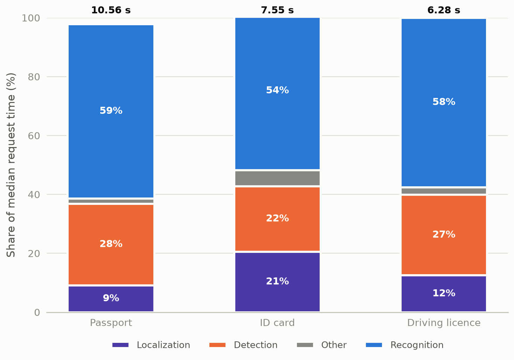

# Experiment 03 — Final Latin pipeline profile

After the recognizer switch, recognition still dominated every route
(59% / 54% / 58% of wall clock), proving the switch fixed the model cost but
not the stage's share — the measured opportunity was real batching, not
another model.
This profile also supplied the first tensor-level proof (D-006) that detection
and recognition issue genuine multi-sample model calls.

## Metadata

| Field | Value |
|---|---|
| Run date | 2026-08-21 15:40 UTC |
| Status | historical — valid profile, measured before shape-invariant batching; no surviving default |
| Decisions touched | fed D-006/D-018 batching work; no surviving default |
| Corpus | 9 passports, 4 logical ID cards, 7 driving licences |
| Runtime | CPU, 4 threads, Paddle 3.2.2 / PaddleOCR 3.7.0 |
| Configuration | `PP-OCRv6_medium_det` + `latin_PP-OCRv5_mobile_rec`, `fastvit_sa24`, generic-Paddle MRZ `20250221`; batches L16/D16/R32/M16 |
| Driver | `benchmarks/historical/final_benchmark.py` |
| Raw evidence | `outputs/benchmarks/07.latin-pipeline-benchmark/20260821T154036Z` |

## 1. Question and why it mattered

Did the Latin recognizer actually remove the bottleneck, and was the configured
batching real at the tensor level? The answer determines whether the recorded
speed and memory measurements describe actual multi-sample model calls.

## 2. Method

Three full-corpus measured repeats plus three one-document scaling-control
repeats per document type, fresh server per repeat group. Stage timings are
wall-clock medians (server response boundary); memory is Linux `ru_maxrss` of
the API process including loaded models. Per-request diagnostics recorded
submitted crop shapes and actual tensor batch sizes.

## 3. Results


*Recognition still dominates after the switch — 59/54/58% of median request
time. Median of 3 full-corpus repeats; stages under 1% folded into Other; the
gap to 100% is uninstrumented request overhead. Totals above the bars are
median wall-clock.*

| Document type | Localization | Canonicalization | Detection | ROI crop | Recognition | MRZ work | Parsing/valid. | Total (wall) | Peak RSS |
|---|---:|---:|---:|---:|---:|---:|---:|---:|---:|
| Passport (9) | 0.9657 | 0.0035 | 2.9244 | 0.0411 | 6.2486 | 0.0146 | 0.0023 | 10.5585 | 3,606.7 MB |
| ID card (4) | 1.5535 | 0.0040 | 1.6792 | 0.0126 | 4.0632 | 0.0320 | 0.0008 | 7.5543 | 3,606.7 MB |
| Driving licence (7) | 0.7846 | 0.0040 | 1.7207 | 0.0240 | 3.6163 | 0.0000 | 0.0017 | 6.2803 | 3,606.7 MB |

Stage medians do not sum exactly to the wall total; the remainder is
uninstrumented request overhead.

Actual batching evidence (the D-006 proof — real multi-sample invocations):

| Document type | Detected / filtered / recognition crops | Detection tensor batches | Recognition tensor batches |
|---|---|---|---|
| Passport (9) | 247 / 100 / 147 | 16, 2 | 32, 32, 32, 32, 19 |
| ID card (4) | 108 / 48 / 60 | 12 | 32, 28 |
| Driving licence (7) | 104 / 11 / 93 | 7 | 32, 32, 29 |

Recognition batching reaches the configured 32 on every route. PaddleOCR does
not expose its internal detector-resized tensor H/W, so the record keeps the
submitted image shapes instead (in `final_latin_profile.json`).

Correctness of the same runs:

| Document type | Visible fields exact | Correct characters | MRZ full exact | Parser OK | Validation OK |
|---|---:|---:|---:|---:|---:|
| Passport | 76/117 | 383/932 | 5/9 | 9/9 | 6/9 |
| ID card | 44/48 | 467/475 | 4/4 | 4/4 | 4/4 |
| Driving licence | 62/91 | 1384/1433 | Not applicable | Not applicable | Not applicable |
| **Corpus total** | **182/256** | **2234/2840** | **9/13** | **13/13** | **10/13** |

## 4. Interpretation

Recognition remained the bottleneck at 59% / 54% / 58% of wall clock — the
model switch reduced recognition cost 3.2× on passports (20.18 → 6.25 s) but
could not change *which* stage dominates, so the next win had to come from
batching and runtime tuning. Detection was
second at 22–28%. The batching was proven real but wasteful for mixed-shape
batches: the first passport detector call filled only 33.8% of its padded
tensor area (MRZ path 67.4%), and the ID-card batch 22.3% — driving licences
batched at 100% because their shapes match. Peak RSS was a stable 3.61 GB:
memory was not the constraint.

## 5. Decision and consequence

No production configuration default survives from this run. Its consequence is
that D-006 batching was accepted as working, while the measured padding waste
was recorded as a follow-up optimization target.

## 6. Negative results and dead ends

- Mixed-shape detector batching padded away 66–78% of tensor area on passports
  and ID cards — batching *more* was not automatically cheaper, which killed
  the assumption that the configured 16/32 batch sizes were optimal.
- The generic-Paddle MRZ route hides its OCR time inside the general
  recognition bucket, so the MRZ-work stage here under-represents total MRZ
  cost.

## 7. Limits

Measured at recognition batch 32 with the pre-correction batching code. Batch
composition is therefore part of this run's method, not an independently
controlled variable. Single machine, 20-document corpus.

## 8. Raw data disposition

| Path | Size | Status | Safe to delete after this report |
|---|---:|---|---|
| `outputs/benchmarks/07.latin-pipeline-benchmark/20260821T154036Z` | 1.5 MB | primary evidence | yes — stage, batching, correctness, padding, and RSS findings are embedded above; per-request shapes regenerate from the preserved driver |
| `outputs/benchmarks/07.latin-pipeline-benchmark/20260821T153647Z`, `20260821T153704Z` | 0.5 MB | **[DELETED]** earlier attempts of the same harness run, uncited | yes |

## 9. Reproduction

```bash
.venv/bin/python benchmarks/historical/final_benchmark.py --help
```

## Changelog

- 2026-08-26 (2nd): figure text moved out of the image per the updated [00](00.TEMPLATE.md)
  figure law; description became the caption above. No content changes.
- 2026-08-26: rewritten to the [00](00.TEMPLATE.md) standard. **Removed** the
  batch-evidence figure: both panels restated the table above them (the
  detection panel had two bars), so the table is the evidence. Shares restated
  on the wall-clock basis; added raw-data disposition and this changelog.
- 2026-08-26: removed cross-report conclusions so the profile stands on its own
  as a historical measurement.
