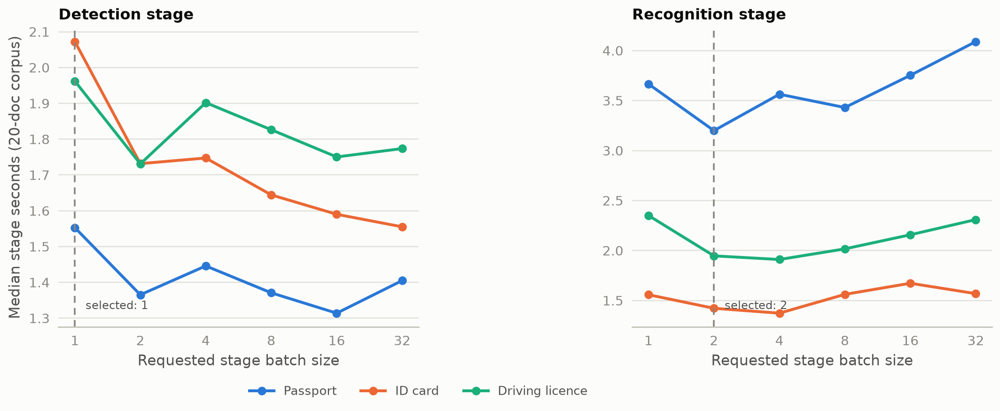
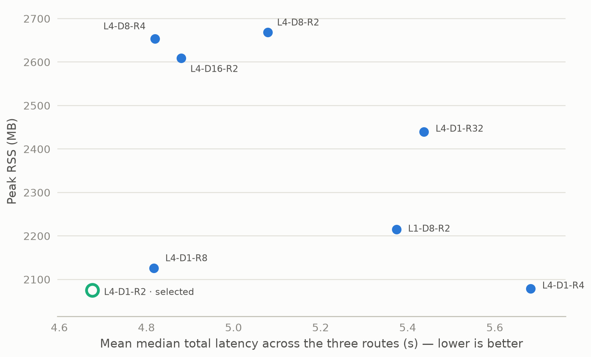

# Experiment 04 — CPU batch-size sweep

Corrected shape-invariant batching changed model-call cardinality without
changing a single returned value: across 20 swept configurations, outputs were
byte-identical to single-image inference. Speed flattened after very small
batches — past D=1 and R=2, more batch bought almost no latency and cost RSS.
The measured result supports D=1/R=2 as the smallest safe combined setting in
this experiment.

## Metadata

| Field | Value |
|---|---|
| Run date | 2026-08-22 (consolidated corrected runs; failed/superseded runs removed) |
| Status | current — batching correctness and batch-size selection |
| Decisions touched | D-006 (evidence), D-021 (batch-size selection) |
| Corpus | 20 logical documents — 9 passports, 4 ID cards, 7 driving licences |
| Runtime | CPU, 4 threads, one process (`TEXT_RECOGNITION_PROCESSES=1`) |
| Models | `fastvit_sa24`, `PP-OCRv6_medium_det`, `latin_PP-OCRv5_mobile_rec`; MRZ localizer `20250222`, generic-Paddle route |
| Driver | `benchmarks/historical/batch_size_benchmark.py`, `combined_batch_benchmark.py` |
| Raw evidence | `outputs/benchmarks/09.batch-size-sweep/20260822T140836Z` |

## 1. Question and why it mattered

Does batch size change throughput without changing outputs — and how large is
"large enough"? D-006 requires real multi-sample tensor calls; production
needed the smallest batch sizes that capture the available speed, because
batch size also sets padding waste and peak memory.

## 2. Method

Two parts. (1) Isolated stage sweep: detection and recognition each swept at
batch 1/2/4/8/16/32 with localization held at 16. (2) Combined confirmation:
eight end-to-end `L*D*R` configurations including the earlier L4-D1-R2/R8/R32
measurements and a later L4-D1-R4 run, merged into one evidence set. Every
configuration: fresh server, one warm-up, three measured repeats, loaded-model
verification, process-group shutdown, lifecycle record. Values are medians of
the three repeats.

## 3. Results


*Isolated stage sweeps: both curves knee at tiny batches — detection gains
~0.5 s/passport from batch 1→2 then flattens; recognition is fastest at 2 and
regresses toward 32. Dashed lines mark the selected D=1 / R=2. Medians of 3
full-corpus repeats; localization held at 16; correctness invariant
everywhere.*

Isolated stage sweep (total s / throughput docs/s / stage s):

| Stage / batch | Passport | ID card | Licence | Peak RSS MB |
|---|---:|---:|---:|---:|
| Detection 1 | 8.476 / 1.061 / 1.553 | 6.841 / 0.581 / 2.072 | 6.245 / 1.120 / 1.962 | 3137.6 |
| Detection 2 | 6.840 / 1.314 / 1.365 | 5.319 / 0.745 / 1.732 | 5.136 / 1.361 / 1.731 | 3207.5 |
| Detection 4 | 7.239 / 1.242 / 1.446 | 5.676 / 0.700 / 1.747 | 5.477 / 1.276 / 1.902 | 3352.9 |
| Detection 8 | 6.004 / 1.497 / 1.371 | 4.814 / 0.823 / 1.644 | 4.909 / 1.424 / 1.826 | 3403.5 |
| Detection 16 | 6.521 / 1.379 / 1.314 | 4.968 / 0.797 / 1.590 | 4.885 / 1.431 / 1.750 | 3497.8 |
| Detection 32 | 6.741 / 1.334 / 1.405 | 5.026 / 0.790 / 1.555 | 4.933 / 1.417 / 1.774 | 3387.4 |
| Recognition 1 | 6.027 / 1.491 / 3.666 | 4.775 / 0.830 / 1.558 | 4.944 / 1.414 / 2.350 | 3486.9 |
| Recognition 2 | 5.481 / 1.640 / 3.199 | 4.670 / 0.850 / 1.422 | 4.486 / 1.558 / 1.947 | 3335.5 |
| Recognition 4 | 5.842 / 1.538 / 3.563 | 4.458 / 0.889 / 1.373 | 4.478 / 1.561 / 1.910 | 3318.8 |
| Recognition 8 | 5.705 / 1.576 / 3.431 | 4.474 / 0.887 / 1.562 | 4.576 / 1.528 / 2.017 | 3298.0 |
| Recognition 16 | 5.993 / 1.500 / 3.752 | 4.888 / 0.810 / 1.673 | 4.685 / 1.492 / 2.158 | 3319.6 |
| Recognition 32 | 6.504 / 1.382 / 4.090 | 4.685 / 0.847 / 1.569 | 4.935 / 1.417 / 2.309 | 3948.2 |

Combined end-to-end configurations (one merged evidence set):

| Configuration | Passport total / docs/s | ID card total / docs/s | Licence total / docs/s | Peak RSS MB |
|---|---:|---:|---:|---:|
| **L4-D1-R2** | 5.292 / 1.698 | 4.442 / 0.893 | 4.293 / 1.627 | 2075.1 |
| L4-D1-R4 | 6.290 / 1.429 | 5.319 / 0.743 | 5.438 / 1.286 | 2079.3 |
| L4-D1-R8 | 5.483 / 1.639 | 4.679 / 0.847 | 4.288 / 1.630 | 2126.0 |
| L4-D1-R32 | 6.472 / 1.389 | 5.031 / 0.789 | 4.809 / 1.454 | 2440.1 |
| L4-D8-R2 | 5.822 / 1.544 | 4.695 / 0.844 | 4.719 / 1.482 | 2669.2 |
| L4-D8-R4 | 5.311 / 1.692 | 4.706 / 0.842 | 4.441 / 1.574 | 2654.1 |
| L4-D16-R2 | 5.624 / 1.598 | 4.538 / 0.872 | 4.476 / 1.562 | 2609.4 |
| L1-D8-R2 | 5.715 / 1.573 | 5.346 / 0.743 | 5.061 / 1.381 | 2215.4 |

Correctness was identical in every corrected configuration: passport 67.52%
fields / 45.17% visible characters / 55.56% MRZ exact; ID card 97.92% / 99.79%
/ 50.00%; driving licence 60.44% / 93.44% / n/a. Merged `output_differences.json`
and `failures.json` are empty.


*The eight combined end-to-end configurations, mean latency across the three
routes vs peak RSS. L4-D1-R2 (outlined point) is the Pareto point — fastest
mean and the lowest RSS; the R4/R32 and D8/D16 variants pay hundreds of MB for
nothing.*

## 4. Interpretation

Both stage curves knee at tiny batches: detection gains ~0.5 s/passport from
1→2 and then wanders within noise up to 32; recognition gains ~0.5 s/passport
from 1→2 and *regresses* beyond (R32 is the slowest recognition setting and
costs +600 MB RSS). Larger detection batches mainly bought padding waste
(mixed-shape batches), not speed. The combined table
confirms L4-D1-R2 as the fastest or tied-fastest configuration on every route
at the lowest RSS. The cost of D1/R2 is more model calls per request (CPU dispatch
overhead) — accepted because the measured alternative was slower *and* heavier.

## 5. Decision and consequence

This experiment selects localization 4 / detection 1 / recognition 2 (D-021)
for the measured CPU corpus. It is also the G6 reference artifact for the
thread-count evidence (the deleted gate formerly compared against
`outputs/benchmarks/09.batch-size-sweep/20260822T140836Z/summary.json`).

## 6. Negative results and dead ends

- The pre-correction implementation padded raw images to the largest
  dimensions in a request chunk — batch size changed model *inputs*, not just
  cardinality. It was replaced; its measurements were discarded as invalid.
- Batches above 8 regressed or plateaued everywhere while increasing RSS
  (R32: +600 MB, slowest of the sweep) — "bigger batch = faster" is false on
  this CPU pipeline.
- L1-D8-R2 (single localization worker) was slower than L4 everywhere:
  localization parallelism matters independently of model batch size.

## 7. Limits

20-document corpus, one machine, one recognition process. Correctness equality
is corpus-specific: shape-invariant batching guarantees identical inputs per
crop, but this run does not prove that every packing strategy preserves
outputs, so "zero differences here" is evidence, not a proof for all inputs.

## 8. Raw data disposition

| Path | Size | Status | Safe to delete after this report |
|---|---:|---|---|
| `outputs/benchmarks/09.batch-size-sweep/20260822T140836Z` | 45 MB | primary evidence; historical G6 gate reference | conditional — all decision-grade numbers are embedded above; retain if the historical evidence is still needed |

## 9. Reproduction

```bash
.venv/bin/python benchmarks/historical/batch_size_benchmark.py --help
.venv/bin/python benchmarks/historical/combined_batch_benchmark.py --help
```

## Changelog

- 2026-08-26 (2nd): added the combined-config latency/RSS trade-off figure
  (the fast-and-light case for L4-D1-R2, previously table-only); figure text
  moved out of the images per the updated [00](00.TEMPLATE.md) figure law.
- 2026-08-26: rewritten to the [00](00.TEMPLATE.md) standard. **Replaced** the
  combined-configurations Pareto figure with the isolated stage-sweep figure:
  the Pareto plotted per-document-type clusters where dominance is undefined
  and labeled only 2 of 24 points, while the sweep curves are the actual
  D=1/R=2 evidence. Reconciled the status wording with the index (this report
  evidences and selects). Added raw-data disposition and this changelog.
- 2026-08-26: removed cross-report conclusions and made the batch setting an
  explicit decision of this report.
