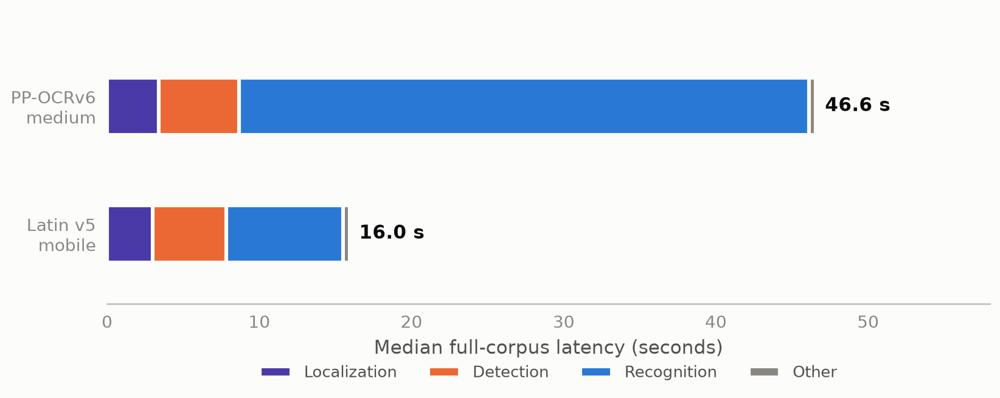
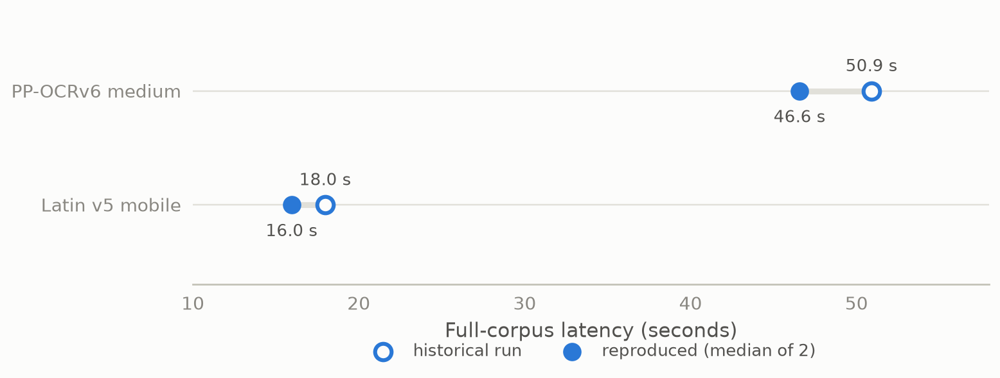

# Experiment 05 — Recognizer audit and strict corrected A/B

The ~3× end-to-end speed gap between `PP-OCRv6_medium_rec` and
`latin_PP-OCRv5_mobile_rec` is caused by the recognizer itself: under a strict
alternating A/B where only `TEXT_RECOGNIZER_MODEL` varied, recognition alone
explains 97.2% of the gap (29.76 s of 30.61 s), at a cost of 1 visible field
and 3 MRZ documents. This is the strongest causal evidence behind D-018/D-021.

## Metadata

| Field | Value |
|---|---|
| Run date | 2026-08-22 (historical pair from the same day audited, then reproduced) |
| Status | current — strongest causal recognizer evidence |
| Decisions touched | D-018, D-021 |
| Corpus | 20 logical documents, 24 physical images; identical hashes and order across all runs |
| Runtime | CPU, 4 threads; four fresh servers in alternating order medium → Latin → medium → Latin |
| Pinned A/B profile | `CPU_THREADS=4`, `TEXT_RECOGNITION_PROCESSES=1`, batches L4/D8/R4/M16, `TEXT_RECOGNITION_PACKING=fixed-width` |
| Driver | `benchmarks/historical/recognizer_ab_benchmark.py` |
| Raw evidence | `outputs/benchmarks/10.recognizer-a-b-comparison/20260822T142128Z`, `outputs/benchmarks/08.recognizer-final-confirmation/20260822T181139Z` |

## 1. Question and why it mattered

Was the observed 50 s vs 18 s recognizer gap a property of the models, or an
artifact of unequal workload, batching, preprocessing, or code paths between
the historical runs? D-018/D-021 rested on that gap; an artifact would have
reopened model selection.

## 2. Method

Two stages. (1) Audit: field-by-field comparison of the two historical runs'
settings and workloads (table below). (2) Strict A/B: four fresh servers in
alternating order, one warm-up per route then one measured full-corpus request
per document-type route; the only configuration change is
`TEXT_RECOGNIZER_MODEL`. Workload equivalence is proven from recorded crop
hashes and tensor batch structures, not assumed.

## 3. Results


*Recognition dominates the gap: the medium bar is 2.9× longer and almost all
of the difference is its blue segment. Median of the two runs per recognizer;
only `TEXT_RECOGNIZER_MODEL` varies.*

| Metric | Medium | Latin | Medium / Latin |
|---|---:|---:|---:|
| E2E latency | 46.571 s | 15.958 s | **2.918×** |
| Localization | 3.392 s | 2.980 s | 1.138× |
| Detection | 5.263 s | 4.848 s | 1.085× |
| Recognition | 37.452 s | 7.694 s | **4.868×** |
| Other pipeline work | 0.408 s | 0.388 s | 1.051× |
| Non-recognition total | 9.119 s | 8.264 s | 1.104× |
| Throughput | 0.431 docs/s | 1.268 docs/s | 2.945× |
| Peak RSS | 2,555 MB | 2,217 MB | 1.152× |
| Visible fields exact | 182/256 | 181/256 | −1 field |
| MRZ full exact | 10/13 | 7/13 | −3 documents |

Recognition accounts for 29.758 s of the 30.614 s gap (97.2%).

Historical audit — the saved pair was already methodologically sound:

| Check | Assessment |
|---|---|
| Dataset, order, routes, workers, repeats, timing boundary | Equivalent |
| Localization/detection/recognizer config | Equivalent except the intentional recognizer change |
| Crop hashes, dimensions, line and filtering counts, tensor batch structures | Identical |
| CPU threads, full environment, git state | **Not recorded — provenance gap** |

Historical reproduction on the current machine (two of the four A/B
observations):

| Recognizer | Historical median | Reproduced runs | Reproduced median | Recognition median | Peak RSS | Correctness |
|---|---:|---|---:|---:|---:|---|
| `PP-OCRv6_medium_rec` | 50.908 s | 44.116 s, 49.026 s | 46.571 s | 37.452 s | 2,555 MB | 182/256 fields; 10/13 MRZ |
| `latin_PP-OCRv5_mobile_rec` | 17.982 s | 17.686 s, 14.230 s | 15.958 s | 7.694 s | 2,217 MB | 181/256 fields; 7/13 MRZ |

Absolute times moved with machine state; the ordering and ~3× gap reproduced.
Across the four measured runs, all 80 document results succeeded.


*The gap is not a machine-state artifact: both recognizers reproduced faster
than their historical runs, by a similar factor, and the ~2.8–3× ordering is
unchanged.*

Workload-equivalence proof (all four measured runs):

| Check | Result |
|---|---|
| Input document hashes/order | Identical (20 logical, 24 physical) |
| Crop hashes and dimensions | Identical |
| Detected / candidates / filtered | Passport 248/148/100; ID 108/60/48; licence 104/93/11 |
| MRZ crops | Passport 9; ID card 4; licence 0 |
| Localization tensor batches | Passport MRZ [4,4,1]; ID docaligner [4,4] + MRZ [4]; licence [4,3] |
| Detection tensor batches | Passport [8,1,3,2,1,1,1,1]; ID [4,4,2,1,1]; licence [7] |
| Recognition tensor batches | Passport 4×26, 3×1, 2×2, 1×37; ID 4×11, 2×4, 1×8; licence 4×15, 3×1, 2×2, 1×26 |
| Requests / outcomes / cleanup | 3 requests per run; 20/20 successes; 4/4 servers cleanly stopped |

## 4. Interpretation

The gap is real, causal, and located: non-recognition work differs by only
10%, recognition by 4.9×. The cost side is exact — one visible field (182 →
181) and three exact MRZ documents (10/13 → 7/13), because the generic-Paddle
MRZ route inherits the selected text recognizer. That coupling is part of this
experiment's result.

## 5. Decision and consequence

D-018/D-021 stand on this evidence: `latin_PP-OCRv5_mobile_rec` stays the
production recognizer and the default MRZ recognizer. Nothing was changed in
this experiment itself; it converted an observation into a controlled result.

## 6. Negative results and dead ends

- The historical pair could **not** be fully reconstructed: CPU threads, exact
  environment, and git state were never recorded. The audit proves
  equivalence of everything that *was* recorded; the A/B re-run exists
  precisely because the rest could not be proven.
- A different full-pipeline run predates tensor-level instrumentation and must
  not be substituted for the 50-second historical run in this comparison.

## 7. Limits

20-document CPU corpus; establishes the cause of the measured speed gap, not
general document accuracy. Machine state moved absolute times ~10% between the
historical and reproduced runs — only ordering and ratios were stable.

## 8. Raw data disposition

| Path | Size | Status | Safe to delete after this report |
|---|---:|---|---|
| `outputs/benchmarks/10.recognizer-a-b-comparison/20260822T142128Z` | 3.9 MB | primary A/B evidence | yes — A/B table, reproduction table, and workload-equivalence proof are embedded above |
| `outputs/benchmarks/10.recognizer-a-b-comparison/20260822T141806Z` | 2.1 MB | **[DELETED]** earlier attempt of the same A/B, uncited | yes |
| `outputs/benchmarks/08.recognizer-final-confirmation/20260822T181139Z` | 3.6 MB | historical pair audited in §3 | yes — its decision-grade numbers (50.908 s / 17.982 s, settings table) are embedded |

## 9. Reproduction

```bash
.venv/bin/python benchmarks/historical/recognizer_ab_benchmark.py --help
```

## Changelog

- 2026-08-26 (2nd): added the historical-vs-reproduced comparison figure (the
  "not a machine artifact" argument, previously prose-only); figure text moved
  out of the images per the updated [00](00.TEMPLATE.md) figure law.
- 2026-08-26: rewritten to the [00](00.TEMPLATE.md) standard. **Removed** the
  A/B "Pareto" figure: two points cannot form a frontier, and its zoomed axis
  visually exaggerated a 1-field difference the table states plainly. Kept the
  stage-timing figure (the 97.2% attribution). Added raw-data disposition and
  this changelog.
- 2026-08-26: removed cross-report conclusions so the causal A/B can be read
  independently.
