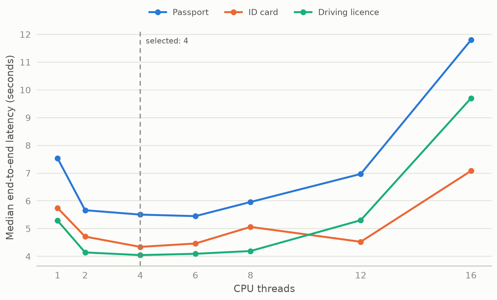
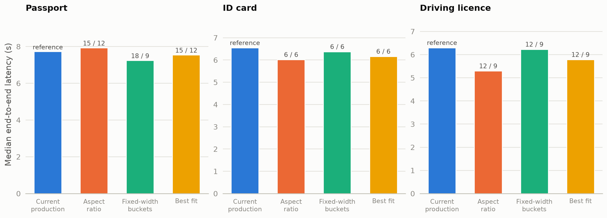
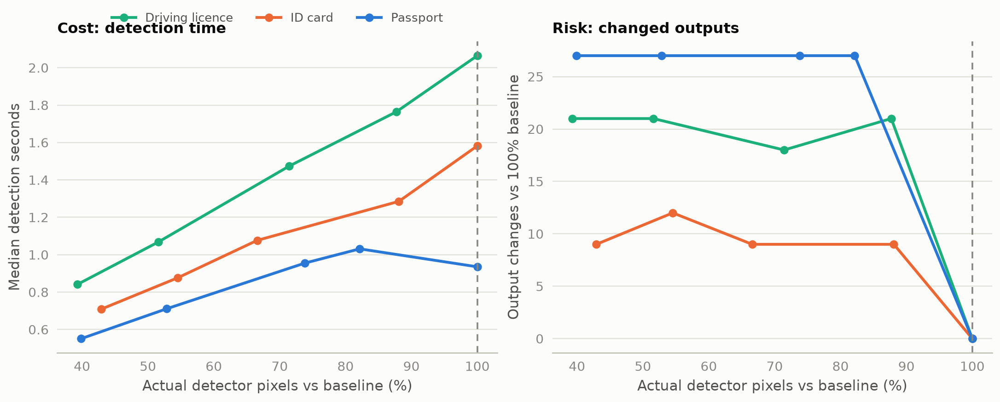
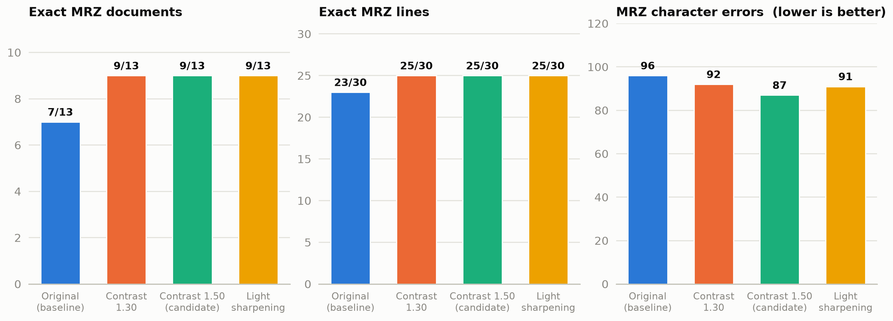

# Experiment 06 — CPU runtime and preprocessing optimization

Four runtime knobs and two preprocessing families were measured on the
finalized pipeline. Three knobs were locked as safe defaults — 4 CPU threads,
current production recognition packing, effective 960-side detector input —
because every alternative either bought nothing or changed outputs. The one
clear win found was MRZ-specific: contrast 1.50 line preprocessing lifted
exact MRZ documents from 7/13 to 9/13 with the fewest character errors
(candidate, not yet a locked default).

## Metadata

| Field | Value |
|---|---|
| Run date | 2026-08-24 (five benchmark tracks, one experiment) |
| Status | current — wholesale basis of D-021; historical acceptance-gate record deleted |
| Decisions touched | D-021 |
| Corpus | 20 logical documents — 9 passports, 4 ID cards (front/back pairs), 7 driving licences; MRZ evaluation on 13 documents / 30 lines |
| Runtime | CPU, Paddle 3.2.2 / PaddleOCR 3.7.0; 4 threads unless the sweep varied `CPU_THREADS` |
| Configuration | `PP-OCRv6_medium_det` (effective side limit 960), `latin_PP-OCRv5_mobile_rec`, `fastvit_sa24`, MRZ detection `20250222` via `mrzscanner`, MRZ recognition generic-Paddle (effective model = the shared Latin recognizer; the configured MRZScanner `20250221` setting is unused on this path); batches L4/D1/R2/M2, `TEXT_RECOGNITION_PACKING=fixed-width` |
| Measurement | fresh server/container per configuration; warm-ups; 3 repeats (thread/packing/resolution sweeps), 5 repeats (MRZ reconciliation) |
| Drivers | `benchmarks/historical/{cpu_thread_benchmark,recognition_packing_benchmark,detector_resolution_workload_benchmark,preprocessing_benchmark,mrz_preprocessing_reconciliation}.py` |
| Raw evidence | see §8 — five run families |

## 1. Question and why it mattered

Which runtime and preprocessing settings are safe to lock for production on
CPU? Each track answers one adoption decision: thread count (deployment
default), recognition packing (throughput knob), detector resolution (biggest
single workload lever), visible/detector preprocessing (accuracy hope), and
MRZ line preprocessing (a possible source of MRZ error in the selected
configuration).

## 2. Method

Each track changes one variable against the finalized L4-D1-R2 baseline with
identical source images and recorded output comparison. Packing and
resolution tracks compare every document-run against the current route and
classify each difference as confidence-only or semantic. The MRZ
reconciliation held MRZ normalization, detection, and crop geometry fixed and
varied only line preprocessing; fixed-crop identity was verified exactly
before measuring. Thread-count acceptance ran through the formal G1–G6 gate
record, which was subsequently deleted after review.

## 3. Results

### CPU thread sweep


*More threads stop helping and then hurt: 4 is the corpus-wide knee; 16
threads nearly triples passport latency. 20-doc corpus, 3 repeats per count,
fresh container per run; correctness invariant across all counts.*

| Threads | Passport (s) | ID card (s) | Driving licence (s) |
|---:|---:|---:|---:|
| 1 | 7.536 | 5.745 | 5.290 |
| 2 | 5.664 | 4.713 | 4.143 |
| **4** | **5.506** | **4.343** | **4.047** |
| 6 | 5.451 | 4.464 | 4.093 |
| 8 | 5.960 | 5.062 | 4.193 |
| 12 | 6.971 | 4.527 | 5.304 |
| 16 | 11.799 | 7.081 | 9.700 |

Semantic correctness was invariant across all thread counts (every comparison
vs the 4-thread output was confidence-only, zero semantic differences). Peak
RSS stayed at 2.04–2.09 GB.

### Recognition packing


*No packing alternative is a safe speedup: annotations show confidence-only /
semantic document-run changes vs the reference (out of 27/12/21 doc-runs) —
every alternative changed predictions with batch composition alone, and the
padding efficiency barely moved.*

| Strategy | Passport (s) | ID card (s) | Driving licence (s) | Confidence-only | Semantic |
|---|---:|---:|---:|---:|---:|
| Current production | 7.729 | 6.553 | 6.299 | — | — |
| Aspect ratio | 7.937 | 6.020 | 5.292 | 33 | 27 |
| Fixed-width buckets | **7.251** | 6.377 | 6.227 | 36 | 24 |
| Best fit | 7.550 | 6.164 | 5.784 | 33 | 27 |

Change counts are repeat-inclusive over 60 document-run comparisons vs the
current route. All three alternatives produced identical crop content but
changed predictions when only batch composition changed; padding efficiency
barely moved (passport 0.7966–0.7999 vs 0.7996; ID 0.8317–0.8342 vs 0.8338;
licence 0.7857–0.7888 vs 0.7882), so none delivered the intended compute
saving.

### Detector resolution


*Left: the benefit — detection time falls almost exactly in proportion to
actual pixels. Right: the cost — output changes vs the 100% baseline stay high
until reductions get so small their pixel savings are immaterial. Resolution
is a workload knob, not an optimization.*

| Document type | Baseline actual pixels / detection | Baseline visible exact | Lower-resolution observation |
|---|---|---:|---|
| Passport | 1,027,072 px; 0.935 s | 79/117; 0 diffs | 92.5% requested → 99.1% actual pixels, still 9 output changes; 85% → 27 changes |
| ID card | 1,376,256 px; 1.582 s | 47/48; 0 diffs | 96.25% requested → 99.7% actual pixels, matched; 88.75% → 9 changes |
| Driving licence | 1,806,336 px; 2.064 s | 62/91; 0 diffs | 85% → 21 changes; 70% → 18 changes, 60/91 exact fields |

### Visible and detector-input preprocessing

Screening of visible-crop candidates (phases A/B/D of the preprocessing run)
found no universal winner: variants that improved one document type or metric
regressed others or inflated recognition latency. Detector-input
preprocessing never beat the original detector input; every tested transform
changed detected-line output and aggregate character accuracy did not improve.

### MRZ line preprocessing (corrected reconciliation)


*All three candidates move every metric the same way — 7/13 → 9/13 exact
documents, 23/30 → 25/30 lines, fewer character errors — so the improvement is
consistent, not a one-metric fluke. 13-document MRZ corpus, 5 repeats,
detection and crop geometry fixed.*

| MRZ variant | Exact documents | Exact lines | Character errors | Valid checks |
|---|---:|---:|---:|---:|
| Original | 7/13 | 23/30 | 96 | 8/13 |
| Contrast 1.30 | **9/13** | 25/30 | 92 | 10/13 |
| **Contrast 1.50** | **9/13** | **25/30** | **87** | **10/13** |
| Light sharpening | **9/13** | 25/30 | 91 | 10/13 |

`contrast_1.50` is the best observed candidate: it ties for best on exact
documents, lines, and valid checks with the fewest character errors. The
operation is exactly `raw normalized MRZ line crop → contrast 1.50 →
fixed-width packing → Latin recognizer` — applied nowhere else. Timing cost
is nil (MRZ preprocessing ≈ 0.02 s per run; stage medians within noise of the
original).

## 4. Interpretation

The safe defaults are the boring ones: threads past 4 buy nothing corpus-wide
and collapse past 8 (16 threads ≈ 3× passport latency — thread thrashing, not
compute); alternative packing changes predictions with batch composition
while failing to reduce padding waste; lower detector resolution converts
pixels into output changes almost linearly (the near-proportional curves
above), so it is a workload knob, not an optimization. The MRZ result is the
exception and is mechanistically plausible: contrast restoration improves the
fixed-crop input before recognition — but it is a 13-document result and stays
a candidate until confirmed on more data.

## 5. Decision and consequence

Locked (D-021): `CPU_THREADS=4`, current production recognition packing
(`TEXT_RECOGNITION_PACKING=fixed-width`), effective 960-side detector input,
original visible and detector preprocessing. Kept: `fastvit_sa24`, L4/D1/R2
batching. Candidate, **not** locked: MRZ line `contrast_1.50` — requires a
separately controlled rollout before becoming a default. The thread decision
is supported by the historical G1–G6 gate record, which was subsequently
deleted after review.

| Component | Setting |
|---|---|
| CPU threads | 4 |
| Localization model / batch | `fastvit_sa24` / 4 |
| Detector / batch / side limit | `PP-OCRv6_medium_det` / 1 / effective 960 |
| Detector preprocessing | original |
| Recognizer / batch / packing | `latin_PP-OCRv5_mobile_rec` / 2 / `fixed-width` |
| Visible-recognition preprocessing | original |
| MRZ recognition | shared Latin recognizer via generic-Paddle |
| MRZ line preprocessing | `contrast_1.50` candidate — not locked |

## 6. Negative results and dead ends

- **Recognition packing**: all three alternatives changed 51–60 of 60
  document-runs (confidence-only or semantic) — batch composition alone
  changes predictions on this pipeline. Not uniformly worse (ID-card MRZ
  2/4 → 4/4, licence exact fields 55/91 → 57/91 for all three), which is
  exactly why they are unsafe: the changes are uncontrolled.
- **Detector resolution**: no tested reduction preserved outputs on all three
  routes; the only matching reduction (ID card at 96.25%) saved 0.3% actual
  pixels — immaterial by construction.
- **Visible preprocessing**: no candidate improved the whole corpus without
  regressions; several improved isolated metrics while inflating recognition
  latency.
- **Detector-input preprocessing**: every transform changed detected-line
  output; none improved aggregate character accuracy.
- **Thread counts > 8**: strictly worse everywhere; 12–16 threads are
  counterproductive on this corpus (oversubscription against other load).

## 7. Limits

All tracks: the supplied 20-document corpus, one CPU machine — not general
accuracy claims. The MRZ candidate rests on 13 documents and is one
contrast-parameter point (1.30 and 1.50 tie on documents; only character
errors separate them). Packing comparisons are sensitive to batch composition.

## 8. Raw data disposition

| Path | Size | Status | Safe to delete after this report |
|---|---:|---|---|
| `outputs/benchmarks/11.cpu-thread-count-benchmark` | 27.4 MB | primary; **read by the deleted G1–G6 CHECK commands** | conditional — numbers embedded above; retain if the historical evidence is still needed |
| `outputs/benchmarks/12.recognition-packing-comparison/20260824T075726Z` | 14.2 MB | primary | yes — tables, change counts, and padding efficiencies embedded |
| `outputs/benchmarks/12.recognition-packing-comparison/20260824T074535Z`, `074555Z`, `075024Z` | 24.8 MB | **[DELETED]** duplicate reruns — manifest identical to the cited run (`6f8a309fa3e3`) | yes |
| `outputs/benchmarks/12.recognition-packing-comparison/20260824T074846Z` | 3.6 MB | **[DELETED]** earlier configuration attempt, superseded | yes |
| `outputs/benchmarks/13.detector-resolution-workload/20260824T090238Z` | 15.6 MB | primary | yes — per-route table and near-linear pixel/time relation embedded |
| `outputs/benchmarks/13.detector-resolution-workload/20260824T084337Z` | 16.5 MB | **[DELETED]** earlier sweep, superseded | yes |
| `outputs/benchmarks/13.detector-resolution-workload/20260824T081725Z`, `20260824T082618Z` | 23.8 MB | **[DELETED]** earlier resolution investigation, uncited by any report | yes |
| `outputs/benchmarks/15.preprocessing-candidate-sweep/20260824T095536Z` | 45.2 MB | **[DELETED]** primary (phases A/B/D) | yes — findings embedded; finalist tables regenerable via the preserved driver |
| `outputs/benchmarks/15.preprocessing-candidate-sweep/20260824T092914Z`, `20260824T093549Z` | 60.8 MB | **[DELETED]** earlier screening attempts — byte-identical input crops, superseded variant sets | yes |
| `outputs/benchmarks/15.preprocessing-candidate-sweep/20260824T102626Z`, `20260824T103056Z` | ~0 | **[DELETED]** empty attempts | yes |
| `outputs/benchmarks/14.mrz-preprocessing-reconciliation/20260824T111635Z` | 149.4 MB | primary MRZ evidence | yes — aggregate, timing, and per-document-change tables embedded |
| `outputs/benchmarks/14.mrz-preprocessing-reconciliation/20260824T105244Z`, `20260824T110435Z` | 288.6 MB | **[DELETED]** duplicate reruns — identical `run_manifest.json`, byte-identical trace payloads | yes |

## 9. Reproduction

```bash
# each track has a preserved one-off driver:
.venv/bin/python benchmarks/historical/cpu_thread_benchmark.py --help
.venv/bin/python benchmarks/historical/recognition_packing_benchmark.py --help
.venv/bin/python benchmarks/historical/detector_resolution_workload_benchmark.py --help
.venv/bin/python benchmarks/historical/preprocessing_benchmark.py --help
.venv/bin/python benchmarks/historical/mrz_preprocessing_reconciliation.py --help
```

## Changelog

- 2026-08-26 (2nd): detector-resolution figure gained the output-changes panel
  (the risk side of the decision, previously table-only); figure text moved
  out of the images per the updated [00](00.TEMPLATE.md) figure law.
- 2026-08-26: rewritten to the [00](00.TEMPLATE.md) standard. **Added** the
  MRZ preprocessing figure (the experiment's only positive result had no
  figure). Removed the mistyped-path correction note (the path is now correct
  everywhere). Added the full raw-data disposition with duplicate-run
  accounting, negative results as first-class records, and this changelog.
