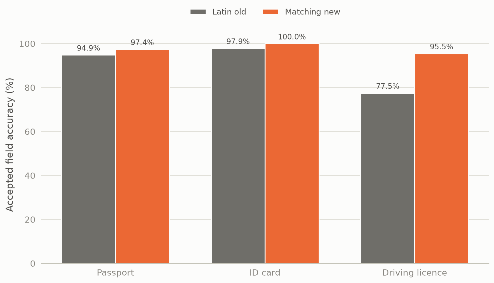
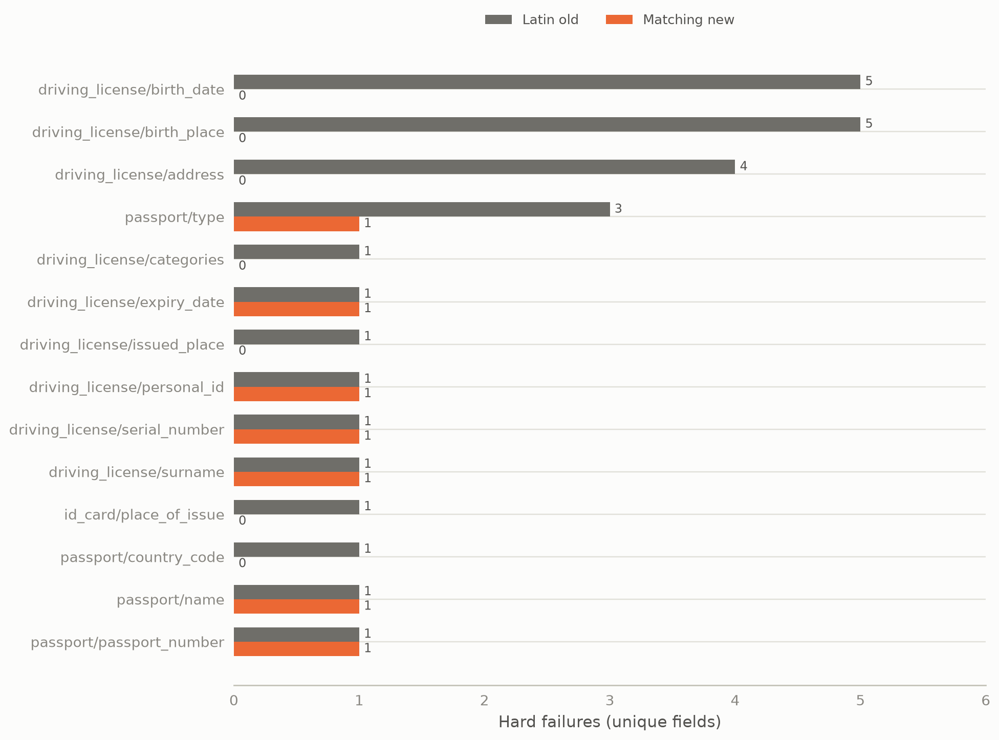
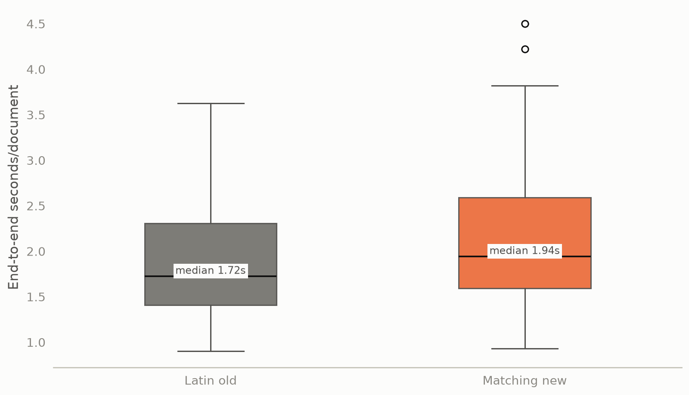
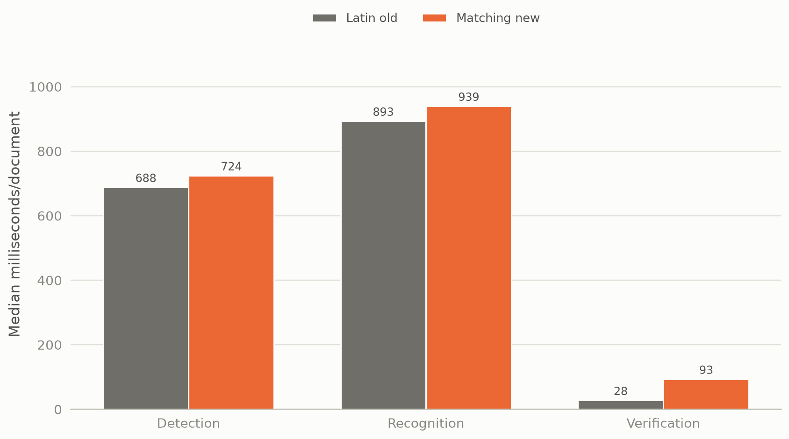

# Experiment 07 — Latin old vs current matching pipeline

This consolidated experiment contains the original conservative-matcher
baseline and its fresh final best-vs-best rerun. On the frozen 20-document,
254-field corpus, the current conservative pipeline accepted 247 fields
(97.24%) versus 227 (89.37%) for the final pre-matching Latin pipeline. It
removed 20 hard failures and improved every document type. Latin is faster by
217.69 ms/document median; Current uses slightly less RSS in the fresh run.
The current pipeline is the recommended complete system, and no production
default was changed.

## Metadata

| Field | Value |
|---|---|
| Run dates | 2026-08-28 05:26 UTC (baseline record); 2026-09-02 11:25 UTC (fresh final rerun) |
| Status | current |
| Decisions touched | D-021, D-026, D-027, D-028, D-029, D-030 (`.codex/DECISIONS.md`) |
| Corpus | 9 passports, 4 paired ID cards, 7 driving licences; 20 logical documents, 24 images, 254 unique fields |
| Runtime | CPU-only; Intel Core i5-12500H, 16 logical CPUs; Python 3.12.3; PaddlePaddle 3.2.2; PaddleOCR 3.7.0; PaddleX 3.7.2; ONNX Runtime 1.22.0 |
| Driver | `benchmarks/maintained/latin_vs_current_benchmark.py` for the fresh rerun; `benchmarks/maintained/verification_benchmark.py` for the original baseline record |
| Primary raw evidence | `outputs/benchmarks/22.latin-vs-current-matcher/20260902T112500Z` |
| Supporting raw evidence | `outputs/benchmarks/17.full-verification-comparison/20260828T052615Z` |

## 1. Question and why it mattered

Which complete frozen system is the better Voight default: the final optimized
Latin-recognizer pipeline before conservative matching, or the final current
conservative verification pipeline? The decision needed to measure correctness,
strict-field safety, document-level reliability, latency, stage cost, batching,
and memory while separating matcher effects from OCR effects. If the current
system had not improved correctness without unsafe strict-field acceptance, it
would not have justified its additional matching work.

## 2. Method

The original baseline record and the fresh rerun used the same validated corpus
and the same global CPU configuration:

```text
RUNTIME_TARGET=cpu
OCR_DEVICE=cpu
CPU_THREADS=4
OMP_NUM_THREADS=1
LOCALIZATION_BATCH_SIZE=4
TEXT_DETECTION_BATCH_SIZE=1
TEXT_RECOGNITION_BATCH_SIZE=2
MRZ_RECOGNITION_BATCH_SIZE=2
TEXT_RECOGNITION_PACKING=fixed-width
```

Both used `PP-OCRv6_medium_det`, `latin_PP-OCRv5_mobile_rec`, Paddle OCR,
`fastvit_sa24` localization configuration, and generic-Paddle MRZ
configuration. The two complete competitors differed in the intended ways:

| Candidate | Frozen difference |
|---|---|
| LATIN_OLD | Exact pre-conservative matcher recovered from the authoritative historical session; source SHA256 `cdfcbcf92f07329ab23ef4bf9cd9ec53c0f4651fea644dc4f8fbb5b9f37155c5` |
| MATCHING_NEW | Current conservative geometry/provenance/global-assignment matcher, with the artifact-selected verification-route override `VERIFICATION_TEXT_RECOGNITION_BATCH_SIZE=4` |

The obsolete `16/16/32/16` configuration was excluded. The fresh rerun used
one full-corpus warm-up and five measured full-corpus passes per candidate, in
balanced order:

```text
Latin → Current
Current → Latin
Latin → Current
Current → Latin
Latin → Current
```

Each candidate used a fresh server process per measured pass. Model startup was
excluded from per-document latency and recorded separately. The original
baseline record also used one warm-up and five measured passes, but its timing
series predates the final balanced rerun and is retained as supporting
evidence, not averaged with it.

The current commit for both records was
`62465df4a67050497e7360e53d959f4202f8afa2`. The Latin matcher had no separate
Git revision; its exact source was recovered from the historical session and
executed in isolation. No model, preprocessing, threshold, annotation,
production configuration, or GPU dependency changed for this comparison.

## 3. Results

The fresh rerun is the primary result. The original run reached the same
correctness totals, which independently supports the direction of the result.

### Overall correctness



*This chart is included because it shows whether one candidate wins only
through aggregate weighting; the table alone is less immediate for the
three-way document-type comparison.*

| Metric | LATIN_OLD | MATCHING_NEW |
|---|---:|---:|
| Accepted fields | 227/254 | 247/254 |
| Accuracy | 89.37% | 97.24% |
| Hard failures | 27 | 7 |
| Hard-failure rate | 10.63% | 2.76% |
| Zero-hard-failure documents | 8/20 | 15/20 |
| Perfect documents | 8/20 | 10/20 |
| Match | 215 | 236 |
| Likely match | 12 | 11 |
| Mismatch | 23 | 6 |
| Not found | 4 | 1 |

### Accuracy by document type

| Document type | Latin accuracy | Current accuracy | Latin hard failures | Current hard failures |
|---|---:|---:|---:|---:|
| Passport | 94.87% (111/117) | 97.44% (114/117) | 6 | 3 |
| ID card | 97.92% (47/48) | 100.00% (48/48) | 1 | 0 |
| Driving licence | 77.53% (69/89) | 95.51% (85/89) | 20 | 4 |

Current wins all three types. The largest effect is driving licences: +17.98
percentage points and 16 fewer hard failures.

### Document-level success

| Document type | Candidate | Zero hard failures | Perfect documents |
|---|---|---:|---:|
| Passport | Latin old | 5/9 | 5/9 |
| Passport | Matching new | 6/9 | 6/9 |
| ID card | Latin old | 3/4 | 3/4 |
| ID card | Matching new | 4/4 | 3/4 |
| Driving licence | Latin old | 0/7 | 0/7 |
| Driving licence | Matching new | 5/7 | 1/7 |
| **All documents** | **Latin old** | **8/20** | **8/20** |
| **All documents** | **Matching new** | **15/20** | **10/20** |

The complete 40-row table is `document_comparison.csv`.

### Strict identifiers and dates

The consolidated strict audit uses independent expected-value review where the
old matcher could return `match` for a value missing a required licence prefix.

| Result | LATIN_OLD | MATCHING_NEW |
|---|---:|---:|
| Correct accepted values | 85 | 92 |
| Incorrect accepted values | 2 | 0 |
| Mismatches | 9 | 4 |
| Not found | 0 | 0 |
| Strict fields evaluated | 96 | 96 |

The two Latin false accepts are driving-licence `license_number` cases for
`d_5` and `d_6`: the old matcher returned `match` while omitting the `5.`
prefix. Current has no incorrect strict-field acceptance. Full rows are in
`strict_field_results.csv`.

### Field-level differences and transitions

| Outcome | Fields |
|---|---:|
| Both succeed | 227 |
| Latin-only success | 0 |
| Current-only success | 20 |
| Both fail | 7 |



*This chart is included because it exposes the concentration of the baseline
problem in driving-licence fields rather than merely repeating the overall
failure total.*

| Latin → Current | Fields |
|---|---:|
| `match → match` | 215 |
| `likely_match → likely_match` | 6 |
| `likely_match → match` | 6 |
| `mismatch → match` | 13 |
| `mismatch → likely_match` | 5 |
| `mismatch → mismatch` | 5 |
| `not_found → match` | 2 |
| `not_found → mismatch` | 1 |
| `not_found → not_found` | 1 |

There are no Latin-only accepted successes and no accepted-result downgrades.
Exact field outcomes are in `field_comparison.csv`; full transitions and cause
labels are in `failure_transitions.csv`.

### Known failure comparison

| Field | Latin | Current | Interpretation |
|---|---|---|---|
| `p_3/type` | not_found | mismatch: `DP` | Current finds a wrong candidate; neither is correct |
| `p_7/name` | mismatch: `OAEBE` | mismatch: `OAEBE` | Same wrong OCR |
| `p_9/passport_number` | mismatch: `FA0111707` | mismatch: `FA0111707` | Same wrong strict value; not accepted |
| `d_3/surname` | not_found | not_found | No candidate; expected annotation `1.` is suspicious |
| `d_6/expiry_date` | mismatch: `46.05.12,2077` | mismatch: `4a. 08.12.2017` | Different wrong OCR candidates |
| `d_6/personal_id` | mismatch: `44.30502730260028` | mismatch: same | Same wrong strict value |
| `d_6/serial_number` | mismatch: `0b0300031233` | mismatch: `46.05.12` | Different wrong OCR candidates |

Neither candidate fixes any of the seven known failures. Raw OCR text,
confidence, geometry, and provenance evidence are retained in
`known_failure_comparison.csv`.

### Controlled same-verifier comparison

Latin OCR evidence passed through the current verifier produced 247/254
accepted fields, 97.24% accuracy, 7 hard failures, 15 zero-hard-failure
documents, and 10 perfect documents. OCR text, geometry, confidence, and
source/provenance comparison found zero differences. This isolates the main
gain to matching/association and verification behavior rather than neural OCR
output. Results are in `controlled_same_verifier.csv` and
`ocr_differences.csv`.

### Performance



*This chart is included because the tail and spread matter for operational
behavior; a single median bar would hide that information.*

| Metric | LATIN_OLD | MATCHING_NEW |
|---|---:|---:|
| Median ms/doc | 1,724.67 | 1,942.36 |
| Mean ms/doc | 1,929.12 | 2,126.47 |
| P90 | 2,938.84 | 3,169.96 |
| P95 | 3,433.93 | 3,618.00 |
| Minimum | 901.02 | 931.47 |
| Maximum | 3,624.21 | 4,502.14 |
| Standard deviation | 689.19 | 760.88 |
| Documents/sec | 0.518 | 0.470 |



*This chart is included because it identifies where the Current latency cost
occurs; zero-call localization and MRZ stages are omitted from the plotted
bars.*

| Stage | LATIN_OLD ms/doc | MATCHING_NEW ms/doc |
|---|---:|---:|
| Localization | 0.00 | 0.00 |
| Detection | 688.14 | 724.16 |
| Recognition | 893.21 | 939.45 |
| MRZ | 0.00 | 0.00 |
| Verification | 27.66 | 93.33 |

Current costs +217.69 ms/doc median (+12.62%), +184.07 ms/doc P95 (+5.36%),
and has 9.28% lower throughput. Both made 24 detection model calls per
measured pass and processed 33.45 recognition candidates per document. Latin
made 444 recognition calls per pass with observed tensor batches of 2/1;
Current made 335 calls with observed tensor batches of 4/1. Full values are in
`performance.csv`, `stage_timings.csv`, and `tensor_batches.csv`.

### Memory and model cost

| Metric | LATIN_OLD | MATCHING_NEW |
|---|---:|---:|
| Detector model | `PP-OCRv6_medium_det` | same |
| Detector directory bytes | 62,299,796 | 62,299,796 |
| Recognizer model | `latin_PP-OCRv5_mobile_rec` | same |
| Recognizer directory bytes | 8,190,444 | 8,190,444 |
| Model initialization median | 4.020 s | 4.018 s |
| Peak RSS | 1,572.590 MB | 1,537.203 MB |
| Cleanup failures | 0 | 0 |

Current used 35.387 MB less peak RSS (-2.25%) in the fresh run. This is a
small difference and should not be treated as a major resource advantage.
CPU utilization was not collected reliably.

### Reconciliation of the two records

The original August record and the fresh September rerun agree on every main
correctness total: 227 versus 247 accepted fields, 27 versus 7 hard failures,
8 versus 15 zero-hard-failure documents, and 8 versus 10 perfect documents.
The fresh run is authoritative for final performance because it includes the
artifact-selected Current recognition override of 4 and explicit balanced
candidate order. Its lower absolute latency than the August record is not a
measured software improvement; the timing conditions differ and the runs are
not averaged.

## 4. Interpretation

Current improves the field result substantially and consistently across all
three document types. Its 20 current-only fields have identical OCR evidence
between candidates, so the gain is attributable to bounded association,
normalization, evidence handling, and global assignment rather than a
recognizer-model change.

The cost is real but bounded: +217.69 ms/doc median and +12.62% latency in the
fresh full path, with 9.28% lower throughput. Current has slightly lower fresh
RSS, but that 35 MB difference is not decisive. Latin is the speed winner;
Current is the correctness and reliability winner.

## 5. Decision and consequence

Classify this as an accuracy/performance trade-off with a clear practical
correctness winner. Keep MATCHING_NEW as the recommended complete Voight
pipeline for this corpus. Keep LATIN_OLD as the low-latency reference.

A document-type hybrid is not justified: Current wins passports, ID cards, and
driving licences, so the observed per-type oracle is still 247/254 and would
add operational complexity without an accuracy gain.

No production model, default, batch value, threshold, preprocessing rule,
thread setting, verification rule, or hybrid router changed as a consequence
of this experiment.

## 6. Negative results and dead ends

- The obsolete `16/16/32/16` configuration was excluded and contributes no
  result.
- No Latin-only accepted field success appeared.
- Neither candidate fixed the seven known failures.
- CPU utilization sampling was not reliable enough to report.
- The fresh strict-field post-processing originally treated every `match`
  status as correct. The consolidated audit corrected the two known Latin
  licence-number false accepts and records the correction in the artifact
  outputs.
- An interrupted preliminary rerun under
  `outputs/benchmarks/22.latin-vs-current-matcher/20260902T110800Z` is not evidence.

## 7. Limits

This is a 20-document, 254-field corpus containing the supplied passport,
paired ID-card, and driving-licence examples. It does not establish general
accuracy across other layouts or populations. Repeated passes characterize
timing variance, not independent accuracy samples. Performance is specific to
this CPU and background-load state. The Latin matcher source is exact as
recovered, but has no standalone Git revision.

## 8. Raw data disposition

| Path | Size | Status | Safe to delete after this report |
|---|---:|---|---|
| `outputs/benchmarks/22.latin-vs-current-matcher/20260902T112500Z` | ~245 MB | primary fresh balanced run; raw requests, traces, OCR evidence, comparisons, and summaries | no — removes final reproducibility |
| `outputs/benchmarks/17.full-verification-comparison/20260828T052615Z` | ~21 MB | supporting original matcher-baseline record and source/configuration provenance | conditional — needed to audit the original run |
| `outputs/benchmarks/22.latin-vs-current-matcher/20260902T110800Z` | ~133 MB | broken/interrupted preliminary attempt; not used | yes — retained only for audit until cleanup |
| `outputs/benchmarks/19.verification-batch-size-sweep/20260828T110401Z` | ~376 KB | supporting artifact selecting Current route recognition batch 4 | conditional — needed to audit B selection |

The primary run contains the requested environment, both exact configs, raw
runs, correctness tables, document and field comparisons, transitions,
strict-field audit, performance and stage timings, resource usage, OCR
comparison, known-failure evidence, controlled verifier result, summary, and
report.

## 9. Reproduction

CPU-only reproduction using the pre-existing local model cache and authorized
dataset:

```bash
.venv/bin/python benchmarks/maintained/latin_vs_current_benchmark.py \
  --model-dir <model-cache> \
  --output-dir outputs/benchmarks/22.latin-vs-current-matcher/<new-run> \
  --port 8037 --timeout 900

.venv/bin/python benchmarks/maintained/latin_vs_current_repair.py \
  outputs/benchmarks/22.latin-vs-current-matcher/<new-run>

.venv/bin/python benchmarks/maintained/latin_vs_current_validate.py \
  outputs/benchmarks/22.latin-vs-current-matcher/<new-run>

.venv/bin/python experiments/tools/make_figures.py
```

## Changelog

- 2026-09-02: consolidated the original verification baseline and fresh final
  best-vs-best rerun into this report. Made the fresh balanced run primary,
  retained the original run as supporting evidence, corrected the two Latin
  strict-field false accepts, and regenerated only four decision-bearing
  figures: document-type accuracy, failure concentration, latency tail, and
  stage cost. Removed the separate duplicate report.
