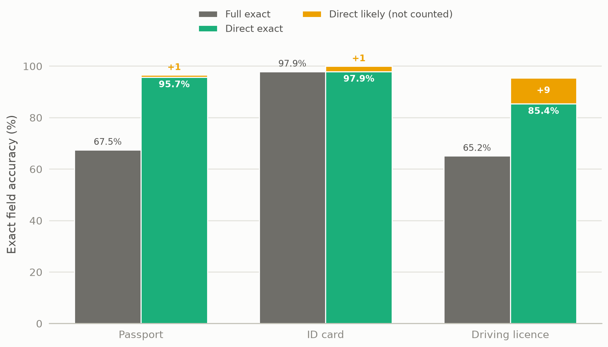
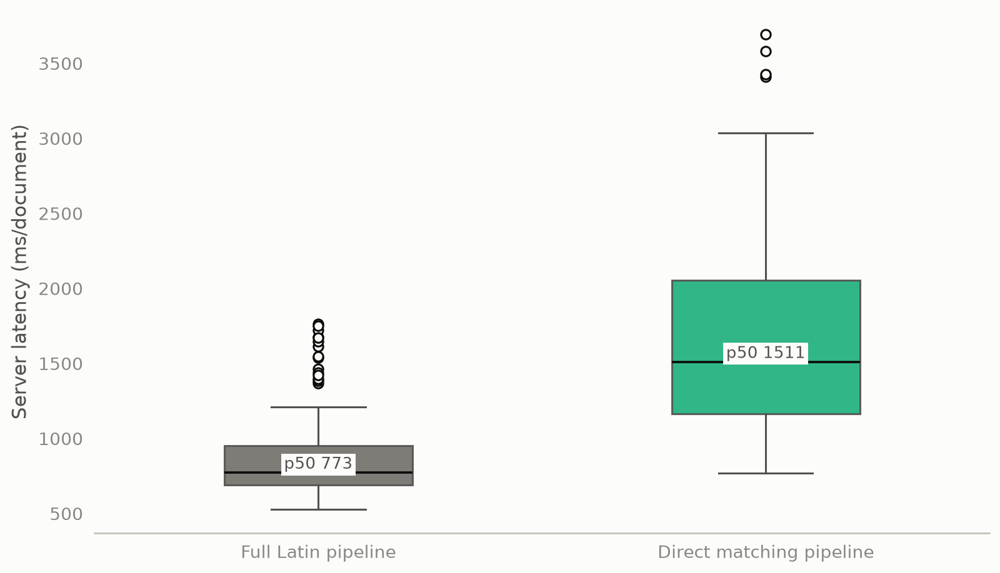
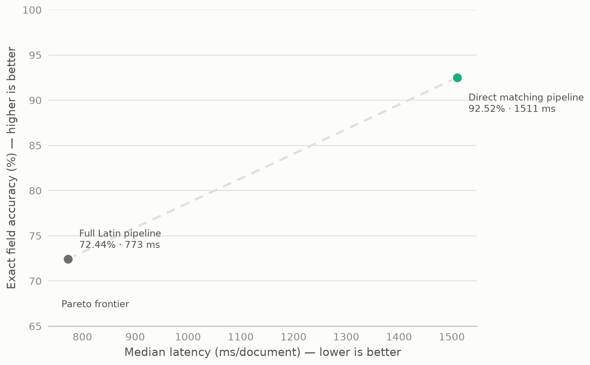
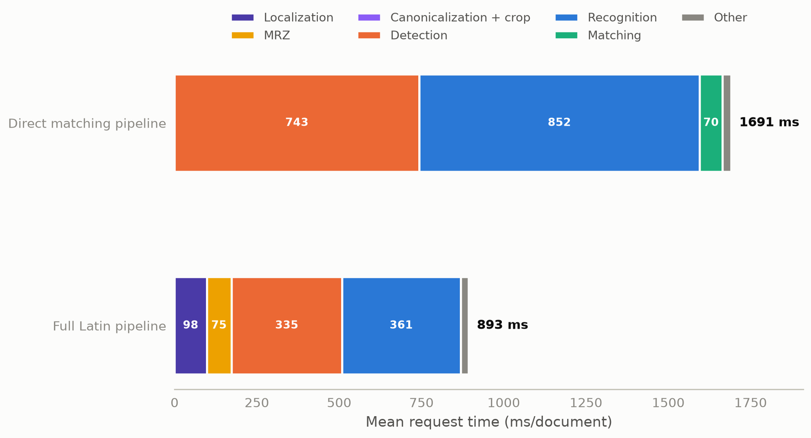
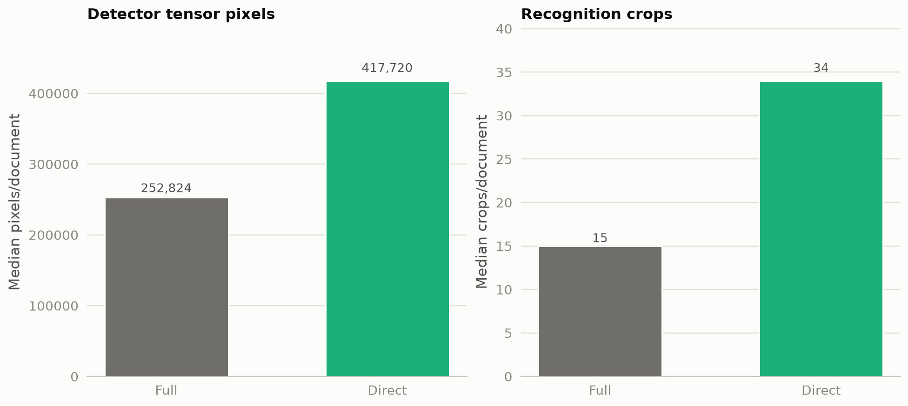

# Experiment 08 — Full Pipeline vs Direct Matching

On the frozen 20-document corpus, exact-value evaluation gives the direct
matching route 235/254 fields (92.52%) versus 184/254 (72.44%) for the full
Latin route. The full route is faster: 772.78 ms/document median versus
1,510.63 ms/document. The direct route's previously reported 247/254 score is
retained as a separate matcher-contract diagnostic; `likely_match` is not
counted in this experiment's accuracy.

## Metadata

| Field | Value |
|---|---|
| Run date(s) | 2026-09-02 UTC; source run `07:19:21Z`, audit `08:04:11Z` |
| Status | current |
| Decisions touched | D-021 (configuration held fixed; no production decision changed) |
| Corpus | 9 passports, 4 paired ID cards, 7 driving licences; 20 logical documents, 24 images, 254 fields |
| Runtime | CPU-only; Python 3.12.3; PaddlePaddle 3.2.2; PaddleOCR 3.7.0; PaddleX 3.7.2; CPU threads 4; `OMP_NUM_THREADS=1` |
| Driver | `benchmarks/maintained/full_pipeline_vs_direct_matching.py`; forensic audit `benchmarks/maintained/audit_full_pipeline_vs_direct_matching.py` |
| Raw evidence | `outputs/benchmarks/20.full-pipeline-vs-direct-matching/20260902T071921Z`; audit `outputs/benchmarks/21.full-pipeline-vs-direct-matching-audit/20260902T080411Z` |

## 1. Question and why it mattered

Does document localization, canonicalization, and document-specific cropping
justify its cost when compared with direct OCR plus geometry-aware matching?
The decision requires an exact-vs-exact accuracy comparison, not a comparison
between fuzzy acceptance policies. If direct matching had not improved exact
field recovery, its lower architectural complexity would not justify replacing
the full route; if it had not reduced OCR work, the full route's preprocessing
cost would need to be reconsidered.

## 2. Method

Both candidates received the same raw source files, including the same front /
back pairs for ID cards, and were evaluated against the same manifest:
`9e28eaafa1efaaeb45c9ee848c0376cad760d214d3da3af45a5296d0598e9b40`.

| Candidate | Route and architecture | Detector | Recognizer | Batches |
|---|---|---|---|---|
| `FULL_LATIN_PIPELINE` | `/v1/ocr/{type}/batch`; localization, canonicalization, and crop enabled | `PP-OCRv6_medium_det` | Paddle `latin_PP-OCRv5_mobile_rec` | localization 4; detection 1; recognition 2; MRZ 2 |
| `DIRECT_MATCHING_PIPELINE` | `/verification/{type}/ocr` → `/check`; raw-image OCR and conservative matcher | `PP-OCRv6_medium_det` | Paddle `latin_PP-OCRv5_mobile_rec` | detection 1; verification recognition 4 |

Both used fixed-width recognition packing, the same CPU settings, OCR
preprocessing, thresholds, annotations, and field definitions. The resolved
configuration files are `full_pipeline_config.json` and
`direct_matching_config.json` in the source run. The prior direct baseline had
`PRELOAD=true`; this run used `PRELOAD=false` for both candidates. That affects
startup/RSS/timing comparability, not the field values. The prior baseline also
sent one `/check` request per field; this run sent one request per document,
which changes only the assignment context for one driving-licence case.

Accuracy is neutral exact normalized value equality. `match` and
`likely_match` statuses are retained as diagnostics only; `likely_match` is
never counted as correct here. A hard failure is either `incorrect` or
`not_found`. Timing used one warmup and five measured passes in balanced order;
model initialization was excluded from request latency.

### Apples-to-apples control

| Held constant | Evidence |
|---|---|
| Source inputs and truth | Same 20 logical documents, 24 images, 254 fields, front/back pairing, annotation values, ordering, and manifest hash |
| OCR models and backend | Paddle `PP-OCRv6_medium_det` detector and `latin_PP-OCRv5_mobile_rec` recognizer in both routes |
| OCR/runtime behavior | CPU-only, 4 CPU threads, `OMP_NUM_THREADS=1`, fixed-width packing, detector resizing, preprocessing, thresholds, and field definitions |
| Measurement | One warmup, five measured passes, balanced order, fresh one-worker process per pass, model initialization excluded |

| Deliberate architecture difference | Why it is allowed |
|---|---|
| FULL localization/canonicalization/profile crop versus DIRECT raw-image OCR | This is the architectural variable being tested |
| FULL recognition batch 2 versus DIRECT verification recognition batch 4 | These are the frozen established settings for the two routes; the override is verification-only |
| FULL MRZ localization/recognition versus DIRECT validated MRZ evidence from raw OCR | The full route owns MRZ preprocessing; the direct route does not load those models |
| FULL `/v1` extraction versus DIRECT `/verification` OCR + matcher | These are the actual production code paths, not a copied evaluator |

Two caveats are explicit rather than hidden: the new run used `PRELOAD=false`
for both candidates while the historical direct baseline used `PRELOAD=true`,
and the historical baseline issued one `/check` request per field while the new
run issued one per document. The latter changes assignment context for one
`d_6` case; neither changes the fact that the new run's exact score is computed
with the same neutral evaluator for both candidates. The former makes historical
RSS/timing comparisons unsafe, but does not bias the within-run architecture
comparison because both candidates used the same new-run setting.

### Match-status conditions

The matcher and the exact evaluator are separate contracts. The exact score in
this report uses only the first row below.

| Class | Condition | Counted as exact-correct? |
|---|---|---:|
| `correct` / exact evaluator | Neutral normalized annotation value equals neutral normalized selected value; empty selection is `not_found` | yes |
| `match` | Matcher-specific normalized equality by field kind (`date`, `identifier`, `name`, or `text`) after label handling | only if the neutral exact evaluator also agrees |
| `likely_match` | Non-empty name/text candidate, shape-compatible, not normalized-equal, with score ≥ 0.78 for names or ≥ 0.86 for other text | no |
| `mismatch` | Candidate exists but fails the applicable threshold; dates and identifiers never receive fuzzy acceptance | no |
| `not_found` | No eligible candidate was assigned | no |

The matcher also requires candidate score ≥ 0.35, preserves geometry/source
evidence, and uses non-overlapping global assignment. In the DIRECT run, the
yellow portions in the accuracy figure are diagnostic `likely_match` fields;
they are deliberately excluded from the green exact bars and from all headline
accuracy values.

## 3. Results

### Overall exact accuracy

| Candidate | Exact-correct fields | Exact accuracy | Hard failures | Zero-HF documents | Perfect documents |
|---|---:|---:|---:|---:|---:|
| `FULL_LATIN_PIPELINE` | 184/254 | 72.44% | 70 (61 incorrect, 9 not found) | 5/20 | 5/20 |
| `DIRECT_MATCHING_PIPELINE` | 235/254 | 92.52% | 19 (17 incorrect, 2 not found) | 9/20 | 9/20 |

DIRECT is ahead by 51 exact fields and 20.08 percentage points. Both candidates
have zero incorrect accepted strict identifiers/dates in the benchmark's
strict-field audit.

### Accuracy by document type

| Document type | FULL exact | DIRECT exact | FULL hard failures | DIRECT hard failures |
|---|---:|---:|---:|---:|
| Passport | 79/117 (67.52%) | 112/117 (95.73%) | 38 | 5 |
| ID card | 47/48 (97.92%) | 47/48 (97.92%) | 1 | 1 |
| Driving licence | 58/89 (65.17%) | 76/89 (85.39%) | 31 | 13 |



*This figure shows the exact-value result by document type. It supports the
question of whether either architecture wins only because of corpus weighting;
DIRECT wins passports, ties ID cards, and wins driving licences. Green is exact;
yellow is DIRECT `likely_match` and is not counted.*

Examples of yellow `likely_match` fields are shown below. They illustrate why
the yellow segment must not be reported as exact accuracy.

| Document / field | Ground truth | OCR-selected value | Matcher score |
|---|---|---|---:|
| `d_1/patronymic` | `MIRZOHID O'G'LI` | `MIRZOHID O'GL` | 0.9565 |
| `d_2/address` | `8. FARG'ONA VILOYATI, TOSHLOQ TUMANI, ISTIQLOL MFY` | `FARG'ONA VILOYATI, TOSHLOQ 8 TUMANI, ISTIQLOL MFY` | 0.9783 |
| `d_3/given_names` | `2. KHKA` | `KQHKA` | 0.8889 |
| `p_3/patronymic` | `WILLIAMOVICH` | `WILLIAMOVECH` | 0.9167 |

These are matcher-accepted `likely_match` examples, but all are `incorrect`
under this report's exact evaluator.

### Document-level success and field transitions

| Transition | Fields |
|---|---:|
| Both exact-correct | 176 |
| FULL-only exact success | 8 |
| DIRECT-only exact success | 59 |
| Both fail exact evaluation | 11 |

The complete 254-row transition table is `field_transitions.csv`. The direct
route's exact-accuracy advantage is not a likely-match artifact.

### Strict identifiers and dates

| Candidate | Correct exact | Incorrect accepted | Mismatch | Not found |
|---|---:|---:|---:|---:|
| `FULL_LATIN_PIPELINE` | 76 | 0 | 18 | 2 |
| `DIRECT_MATCHING_PIPELINE` | 93 | 0 | 2 | 1 |

The strict-field result is in `strict_field_results.csv`. No architecture was
allowed to improve its headline score by accepting a wrong identifier or date.

### Known failures

The seven requested known cases remain in `known_failure_comparison.csv` with
annotation, both outputs, raw evidence, and failure cause. The architecture
benchmark's reported direct 92.52% must not be interpreted as a regression from
the prior 97.24%: the latter counted `match + likely_match`, while this report
uses exact value equality only.

### Performance

| Metric | FULL | DIRECT |
|---|---:|---:|
| Median ms/document | 772.78 | 1,510.63 |
| Mean ms/document | 893.37 | 1,690.53 |
| P50 | 772.78 | 1,510.63 |
| P90 | 1,442.06 | 2,802.56 |
| P95 | 1,649.21 | 2,961.67 |
| Minimum | 526.47 | 768.18 |
| Maximum | 1,765.03 | 3,694.22 |
| Standard deviation | 316.30 | 691.49 |
| Documents/second | 1.1194 | 0.5915 |

FULL is 737.84 ms/document faster at the median, or 48.84% lower latency
relative to DIRECT. Its throughput is higher by 0.5278 documents/second;
DIRECT is 47.15% lower relative to FULL.



*This figure shows the request-time spread and tail, supporting the latency
choice rather than relying on the median alone.*



*Both points are non-dominated: DIRECT buys exact accuracy at higher latency,
while FULL buys speed at lower exact accuracy. This is the experiment's
decision-bearing Pareto trade-off.*

### Timing breakdown

The following is request-level additive mean accounting. Small stages are
grouped into `Other` in the figure so each stack sums to the measured total.

| Stage | FULL mean ms/doc | DIRECT mean ms/doc | FULL median ms/doc | DIRECT median ms/doc |
|---|---:|---:|---:|---:|
| Input preparation | 15.13 | 14.75 | 3.32 | 4.24 |
| Document localization | 97.53 | N/A | 112.72 | N/A |
| MRZ work | 74.85 | N/A | 109.89 | N/A |
| Canonicalization + crop | 0.88 | N/A | 0.95 | N/A |
| Text detection | 335.08 | 743.35 | 281.18 | 585.84 |
| Text-line cropping | 4.25 | 5.81 | 4.06 | 5.25 |
| Text recognition | 360.68 | 851.65 | 341.74 | 817.34 |
| OCR unpacking | 0.13 | 0.27 | 0.11 | 0.23 |
| Matching / field extraction | 0.36 | 69.72 | 0.33 | 65.09 |
| Result assembly | 0.57 | 0.28 | 0.52 | 0.26 |
| Other | 3.90 | 4.70 | 3.03 | 3.57 |
| **Total** | **893.37** | **1,690.53** | **772.78** | **1,510.63** |



*This figure uses additive mean request accounting, so the stacks reconcile to
the totals. Independently computed stage medians are retained in the raw
benchmark but must not be summed.*



*This figure shows the measured tensor/crop workload that explains why FULL's
preprocessing cost is recovered downstream.*

## 4. Interpretation

FULL spends **113.72 ms/document median** on document localization plus
canonicalization/cropping when those request-level stages are added. MRZ work
is separate and contributes **109.89 ms/document median** in the additive
request accounting.

The cost is recovered downstream. FULL's median detector time is 281.18 ms
versus 585.84 ms for DIRECT, and recognition is 341.74 ms versus 817.34 ms.
FULL has fewer measured detector tensor pixels (252,824 versus 417,720 median)
and fewer recognition crops (15 versus 34 median). DIRECT's matcher itself
costs 65.09 ms/document median versus FULL field extraction at 0.33 ms.

The detector-pixel metric is the sum of actual padded detector tensor areas over
the document's detector calls, not source-image area. Crop counts are actual
recognition crop records. The model-load traces show FULL resident components
for document alignment/localization and MRZ localization/scanning in addition
to the shared text detector and recognizer; DIRECT loads only the shared text
detector and recognizer.

The source benchmark recorded approximately 86 MB RSS for both candidates, but
that is invalid as a peak comparison: its sampler ran only during health
startup and stopped before model loading and measured requests. The previous
verification benchmark sampled the tracked process through warmup and work and
recorded approximately 1.5 GB peaks. No RAM winner is claimed here.

## 5. Decision and consequence

This report records an exact-vs-exact architectural comparison:

- exact accuracy winner: `DIRECT_MATCHING_PIPELINE`;
- latency and throughput winner: `FULL_LATIN_PIPELINE`;
- Pareto result: neither dominates the other;
- memory result: unresolved because the source RSS measurement is invalid.

No production code, model, annotation, benchmark configuration, or `.env`
setting was changed. The original architecture report should be corrected to
use exact-vs-exact accuracy and to remove the invalid RSS comparison. A
separate RSS-only measurement is required; a full benchmark rerun is not
required for the accuracy discrepancy.

## 6. Negative results and dead ends

- The prior `97.24%` direct number was a matcher-contract result, not exact
  accuracy; `likely_match` is deliberately excluded here.
- The source benchmark's 86 MB RSS values are startup samples, not peaks.
- Independently calculated stage medians were not used as additive totals.
- **[DELETED]** The requested August `full_verification/20260828T052615Z`
  path was deleted and is absent in this workspace; the available numbered
  equivalent was not needed for the exact architecture result.
- No hybrid route or production default was introduced.

## 7. Limits

This is a 20-document corpus containing the supplied Uzbekistan passport,
paired ID-card, and driving-licence layouts. It does not establish general
accuracy across other layouts, populations, image conditions, or hardware.
Repeated passes characterize timing variation, not independent accuracy
samples. The direct and full routes have intentionally different OCR workload
and batch behavior because those are part of the frozen architecture
configurations. Memory remains unvalidated until the RSS-only rerun.

## 8. Raw data disposition

| Path | Size | Status | Safe to delete after this report |
|---|---:|---|---|
| `outputs/benchmarks/20.full-pipeline-vs-direct-matching/20260902T071921Z` | ~252 MB | primary architecture run; raw runs, configs, workload, timing, accuracy, and resident-model traces | no |
| `outputs/benchmarks/21.full-pipeline-vs-direct-matching-audit/20260902T080411Z` | ~324 KB | forensic audit and additive timing correction | no — supports the evaluator and RSS caveats |
| `outputs/benchmarks/19.verification-batch-size-sweep/20260828T110401Z` | ~376 KB | supporting direct batch-4 selection and 247/254 matcher-contract baseline | conditional |
| `outputs/benchmarks/22.latin-vs-current-matcher/20260902T112500Z` | ~245 MB | supporting current direct matcher field-level/OCR evidence | conditional |

The **[DELETED]** `outputs/benchmarks/full_verification/20260828T052615Z` path
is not cited as evidence.

## 9. Reproduction

The existing measured run is documented, not rerun by this report. To
regenerate the figures from the cited raw data:

```bash
.venv/bin/python -c 'from experiments.tools.make_figures import fig08; fig08()'
```

The complete historical figure command remains:

```bash
.venv/bin/python experiments/tools/make_figures.py
```

It currently stops in an unrelated older figure at `fig01` because one legacy
summary lacks the historical `passport_full_production` key. Experiment 8's
figures were generated directly through the same shared style module.

## Changelog

- 2026-09-02: added the experiment-8 documentation for the audited full versus
  direct architecture run; changed the headline to exact-vs-exact, added the
  accuracy/latency Pareto frontier and workload/timing figures, and recorded
  the invalid RSS measurement. No earlier report content was removed.
