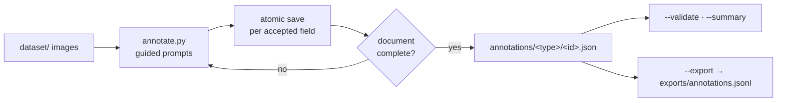

# Local ground-truth annotation



Place original images under `dataset/`:

```text
dataset/
├── passport/<id>.jpg
├── id_card/<id>/front.jpg
├── id_card/<id>/back.jpg
├── driving_license/<id>.jpg
├── annotations/{passport,id_card,driving_license}/<id>.json
└── exports/annotations.jsonl
```

Supported source extensions are `.jpg`, `.jpeg`, `.png`, and `.webp`.
Sources are only read; they are never renamed, moved, or rewritten.

```bash
# Start or resume
uv run --no-sync python scripts/dataset/annotate.py

# Only passports
uv run --no-sync python scripts/dataset/annotate.py --type passport

# Edit one item, including a completed item
uv run --no-sync python scripts/dataset/annotate.py --id passport_001 --edit

# Read-only checks and progress
uv run --no-sync python scripts/dataset/annotate.py --validate
uv run --no-sync python scripts/dataset/annotate.py --summary

# Consolidated secondary export
uv run --no-sync python scripts/dataset/annotate.py --export
```

At any field prompt use `:q`, `:skip`, `:back`, `:empty`, `:unreadable`, or
`:help`. A normal blank input is a real empty string; `:empty` means visibly
absent. Each accepted entry is atomically saved immediately. Complete and
skipped documents are ignored on a normal run; `in_progress` documents resume
at their first missing entry before new documents.

Each canonical annotation is one JSON object:

```json
{
  "id": "passport_001",
  "document_type": "passport",
  "images": {"image": "passport/passport_001.jpg"},
  "image_sha256": {"image": "<sha256>"},
  "fields": {
    "surname": {"state": "value", "value": "ABDULLAYEV"},
    "patronymic": {"state": "empty", "value": null},
    "authority": {"state": "unreadable", "value": null}
  },
  "mrz": {"lines": ["<raw line 1>", "<raw line 2>"]},
  "notes": "",
  "status": "complete"
}
```

`fields` uses the production API/profile names for that document type. Missing
keys are not annotated yet. Passport and ID-card MRZ lines are independent raw
ground truth and are never copied to or from visible fields. Driving licences
have no `mrz` member.

This document-level ground-truth tool is separate from the profile-geometry
tool in [docs/dataset.md](../../docs/dataset.md). The former records expected
values under `dataset/annotations/`; the latter promotes reusable rectangles
from the authorized `annotation_input/` fixtures into `config/`.
